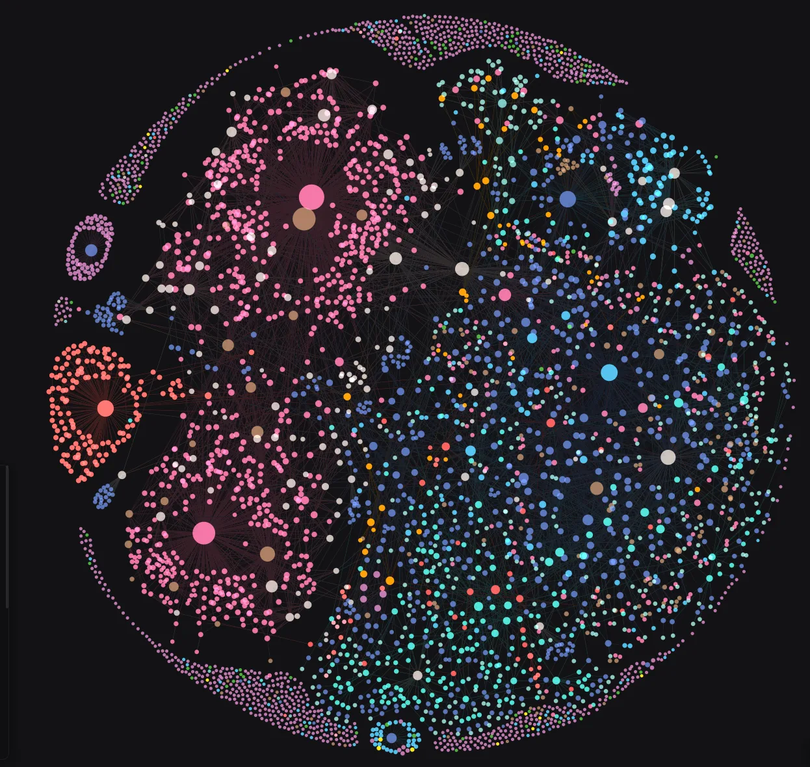

# RO-Crate Analysis and Visualisation Tools

[](https://github.com/unimelbmdap/cdl2-rocrates/actions/workflows/test.yml)

[](https://github.com/astral-sh/uv)
[](https://github.com/astral-sh/ruff)
[](https://unimelbmdap.github.io/cdl2-rocrates/)
[](https://github.com/unimelbmdap/cdl2-rocrates/milestones)


<p align="center">
  
</p>

<p align="center"><em>The University of Melbourne Perpetual Calendar RO-Crate rendered as a network graph with crategraph.</em></p>

> [!IMPORTANT]
> **Early development.** crategraph is in active early development and has not had a stable
> release. The public API is still taking shape, so names, signatures, and behaviour can change
> between commits, sometimes in ways that will break existing code.
>
> This follows [Semantic Versioning](https://semver.org/#spec-item-4): while the version number
> begins with `0.`, anything may change at any time and the public API should not be considered
> stable. If you rely on crategraph in your own work, pin a specific commit and re-run your own
> checks before moving to a newer one.

## ARDC Community Data Lab Phase 2: Work Package 2

Tools for analysing and visualising research data collections stored in RO-Crates.

## About

RO-Crates offer a powerful format for preserving HASS and GLAM collections with curated metadata and linkage information. While existing tools focus on creating RO-Crates as archival objects, this project unlocks them for active research use.

This project develops accessible tools for researchers to:

- Analyse network relationships and metadata within and across RO-Crates
- Visualise collections interactively, both online and offline
- Understand and work with RO-Crate workflows through documentation and training

A set of RO-Crates converted from OHRM databases are available on FigShare: https://figshare.unimelb.edu.au/projects/OHRM_Upload_Project/230466

## Project Goals

The project focuses on use-case driven development, prioritising specific research contexts for HASS and GLAM collections. Initial work will target:

- Visualisation of linkages between RO-Crates
- Visualisation of contents within RO-Crates

## Background

This work builds on existing University of Melbourne projects and external collaborations that have developed specialised RO-Crate tools and workflows, including work derived from former Online Heritage Resource Manager projects.

## Quick Start

After cloning the repo, you can start exploring immediately — no manual install step needed. `uv run` creates an isolated environment and installs the package automatically on first use.

**Interactive Python shell:**

```bash
uv run --all-extras python
```

```python
>>> from crategraph import Crate
>>> crate = Crate("tests/fixtures/minimal-crate/")
>>> crate.entities
>>> crate.relationships
```

**Jupyter notebook:**

```bash
uv run --all-extras --with jupyter jupyter notebook
```

Save notebooks in the `notebooks/` directory — it's gitignored so scratch work won't end up in the repo.

## Documentation

Full documentation, guides, and API reference are published at **[unimelbmdap.github.io/cdl2-rocrates](https://unimelbmdap.github.io/cdl2-rocrates/)**.

- **[Getting Started](https://unimelbmdap.github.io/cdl2-rocrates/getting-started/)** — install, load a crate, and take a first look.
- **[Tutorials](https://unimelbmdap.github.io/cdl2-rocrates/tutorials/)** — task-focused guides, including [Visualising a Collection](https://unimelbmdap.github.io/cdl2-rocrates/tutorials/visualising-a-collection/), [From Graph to DataFrame](https://unimelbmdap.github.io/cdl2-rocrates/tutorials/from-graph-to-dataframe/), and [Searching a Collection](https://unimelbmdap.github.io/cdl2-rocrates/tutorials/searching-a-collection/). A one-page [cheat sheet](https://unimelbmdap.github.io/cdl2-rocrates/tutorials/crategraph-cheatsheet/) covers the common commands.
- **[Case Studies](https://unimelbmdap.github.io/cdl2-rocrates/case-studies/)** — real collections explored end to end, such as [Navigating the Encyclopedia of Australian Science](https://unimelbmdap.github.io/cdl2-rocrates/case-studies/questions-for-a-collection-eoas/) and the [Australian Radio Talkback corpus](https://unimelbmdap.github.io/cdl2-rocrates/case-studies/australian-radio-talkback/).
- **[API Reference](https://unimelbmdap.github.io/cdl2-rocrates/api/)** and **[Architecture](https://unimelbmdap.github.io/cdl2-rocrates/architecture/)** — for extending crategraph or understanding its internals.

## Development Setup

### Prerequisites

- Python 3.12 or later
- [uv](https://docs.astral.sh/uv/) package manager

### Installation

```bash
# Install dependencies
uv sync

# Install pre-commit hooks
uv run pre-commit install
```

### Running Tests

```bash
uv run pytest
```

### Code Quality

This project uses [Ruff](https://docs.astral.sh/ruff/) for linting and formatting, enforced via pre-commit hooks.

```bash
# Run pre-commit checks manually
uv run pre-commit run --all-files

# Run linter
uv run ruff check .

# Run formatter
uv run ruff format .
```

## Licence

Licensed under the Apache License, Version 2.0. See the [LICENSE](LICENSE) file for the full terms.

## AI Attribution

[](https://aiattribution.github.io/statements/AIA-HAb-CeNc-Hin-R-?model=Opus%2C%20Codex)
