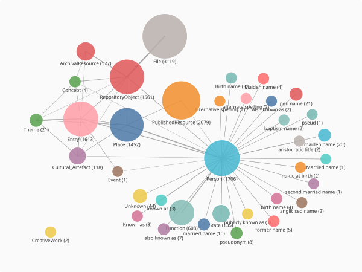
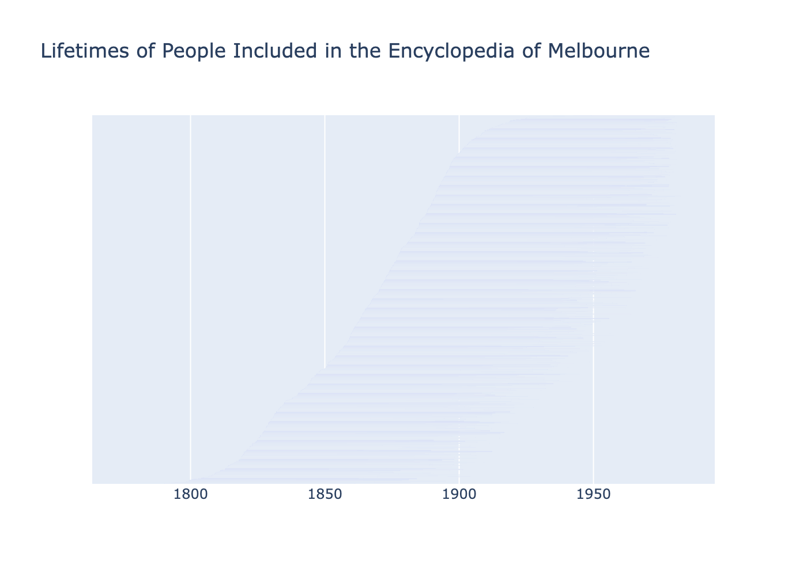

<!--
Case study. All code below was run against data/ohrm/EMEL-ro-crate on 2026-06-25;
the outputs shown are real. The embedded figures are rendered to docs/assets/emel-*
(see scratchpad render script); regenerate them if the crate or code changes.
Prose preserves the original author's notebook; only the agreed changes were applied
(typo/bug/title fixes, the annotate/where + entity_records reworks, the birthplace
enrichment section, and a filled-in "What you'll learn").
-->

# Lifelines of the Encyclopedia of Melbourne

The [Encyclopedia of Melbourne](https://www.emelbourne.net.au/) is an online encyclopedia made up
of 1,613 entries detailing the history of Melbourne on different themes, as well as summaries of
1,241 key figures and links to their entries in the Australian Dictionary of Biography. This data
is also saved as an RO-Crate.

This tutorial will extend that of [Exploring temporal dimensions of RO-Crates](../tutorials/exploring-temporal-dimensions.md)
to build a comparative timeline of the people included in the Encyclopedia of Melbourne, and
explore what analysis we can take from it.

## What you'll learn

- Getting an overview of a large crate with `summary()` and `glimpse()`.
- Reading and formatting dates across several entity types with `convert_dates()`.
- Separating the people who are *subjects* of entries from the *authors* who wrote them, using
  `annotate_entities()` and `where()`.
- Following relationships to add each person's birthplace.
- Building a comparative timeline of people's lives with Plotly, and reading patterns from it.

## Running this tutorial

While `crategraph` is pre-release, launch from the repository root with `uv run`, pulling in the
project plus the plotting dependencies:

```bash
uv run --all-extras --with jupyter --with pandas --with plotly --with kaleido jupyter notebook
```

## 1. Load the crate and get an overview

```python
from crategraph import Crate

crate = Crate("data/ohrm/EMEL-ro-crate")
crate
```

```
Graph(12748 entities, 26840 relationships, source='data/ohrm/EMEL-ro-crate')
```

```python
crate.summary()
```

```
=== Graph Summary ===
Source: data/ohrm/EMEL-ro-crate
Entities: 12748 | Relationships: 26840

Entity types:
  Person                                             1706  ▒▒▒▒▒▒▒▒▒▒▒▒▒▒▒
  Entry                                              1613  ▒▒▒▒▒▒▒▒▒▒▒▒▒▒
  File, DigitalObject, thumbnail                     1559  ▒▒▒▒▒▒▒▒▒▒▒▒▒▒
  Place                                              1452  ▒▒▒▒▒▒▒▒▒▒▒▒▒
  RepositoryObject, DigitalObject, digitised record  1370  ▒▒▒▒▒▒▒▒▒▒▒▒
  PublishedResource, ResourceSection                 1299  ▒▒▒▒▒▒▒▒▒▒▒
  ...
  Theme                                                21

Relationship types:
  hasFile                 3122  ▒▒▒▒▒▒▒▒▒▒▒▒▒▒▒
  dobject                 3119  ▒▒▒▒▒▒▒▒▒▒▒▒▒▒▒
  preparedBy              2906  ▒▒▒▒▒▒▒▒▒▒▒▒▒▒
  Entry                   2441  ▒▒▒▒▒▒▒▒▒▒▒▒
  Primary                 2261  ▒▒▒▒▒▒▒▒▒▒▒
  Related                 2114  ▒▒▒▒▒▒▒▒▒▒
  Relationship            2073  ▒▒▒▒▒▒▒▒▒▒
  Theme                   1757  ▒▒▒▒▒▒▒▒
  linkedArchivalResource  1477  ▒▒▒▒▒▒▒
  birthPlace              1180  ▒▒▒▒▒▒
  deathPlace              1100  ▒▒▒▒▒
  deathState              1081  ▒▒▒▒▒
  birthState              1038  ▒▒▒▒▒
  place                    867  ▒▒▒▒
  alsoKnownAs              304  ▒

Most connected: Victoria (1011), VPRS 3183 City of Melbourne Town Clerk's Correspondence Files II (835), The Everyday War: World War I and the City of Melbourne (701), Melbourne (699), Nicole Davis (688)
```

```python
crate.glimpse()
```



Reviewing the summary and the glimpse, we can see that they largely fall into

- Persons, with many smaller associated alternative name options
- Places
- Entries
- Repository objects and their connected files, connecting to all three.

## 2. Formatting Dates

In [Exploring temporal dimensions of RO-Crates](../tutorials/exploring-temporal-dimensions.md) we
learnt how to use crategraph to read, format, and save the dates that are included in different
entities, and created a timeline across different entity types. We will use that code to see how
dates are used in this dataset:

```python
import pandas as pd
import plotly.express as px

types = ["Person", "Entry", "Event", "Place", "Theme", "RepositoryObject"]
dated = crate.select(entity_types=types).convert_dates(report=True)

comparison_df = pd.DataFrame(
    dated.entity_records(
        columns=["label", "type", "start_date", "end_date", "date_precision", "year"]
    )
)

fig = px.scatter(
    comparison_df,
    x="start_date",
    y="type",
    color="type",
    hover_name="label",
    hover_data={"year": True, "date_precision": True, "type": False, "start_date": False},
    category_orders={"type": types},
    title="Encyclopedia of Melbourne records through time, by type",
)
fig.update_traces(marker=dict(size=11, opacity=0.6))
fig.update_layout(yaxis_title=None, xaxis_title="Year", legend_title=None, height=400)
fig.show()
```

```
convert_dates: parsed 2669/2673 entities with date fields (100%).
  4 unparseable — e.g.:
    #D00000390   startDate='27 Aug c. 1900'
    #D00000237   startDate='undated'
    #D00000181   startDate='undated'
    #D00000227   startDate='undated'
```

<iframe src="../../assets/emel-records-by-type.html" width="100%" height="430"
        style="border:none" loading="lazy" title="Encyclopedia of Melbourne records by type"></iframe>

Here we can see we have meaningful dates for many Person and Repository Object entities, but only
one for an Entry and none for Events and Places. We can also check the precision on our dates:

```python
comparison_df["date_precision"].value_counts()
```

```
date_precision
day     2651
year      18
Name: count, dtype: int64
```

And see that in almost every case, we have dates precise to the day.

## 3. Tidying the Persons data

Let's delve into the people included in the Encyclopedia of Melbourne. There are 1,706 `Person`
entities, but they are not all the same kind of person: some are the *subjects* of entries, and
some are the *authors* who wrote them. The subjects carry an `identifier` and birth and death
dates; the authors carry only a name.

Rather than build a DataFrame of all of them and split it apart afterwards, we can mark the
difference on the graph itself and filter on it. `annotate_entities` adds a field computed for each
person, and `where` keeps the ones we want. While we're here, we convert the dates and give the
start and end dates names that mean something for a person (birth and death):

```python
people = (
    crate.select(entity_types=["Person"])
    .convert_dates(report=False)
    .annotate_entities(
        is_author=lambda e: e.get("identifier") is None,
        birth_date=lambda e: e.start_date,
        death_date=lambda e: e.end_date,
    )
)

subjects = people.where(is_author=False)
authors = people.where(is_author=True)

print(f"{len(subjects.entities)} subjects and {len(authors.entities)} authors")
```

```
1241 subjects and 465 authors
```

That leaves 1,241 subjects, which matches the Encyclopedia's own count of key figures, and 465
authors. Now we can build a DataFrame of just the subjects. `entity_records` takes the columns we
want, so we ask for only the ones that are useful here rather than loading every property and
tidying up afterwards:

```python
columns = [
    "name", "alsoKnownAs", "birth_date", "death_date",
    "date_precision", "gender", "function", "summaryNote", "year",
]
df = pd.DataFrame(subjects.entity_records(columns=columns))
```

We can then check and confirm we have a birth and death date for all our remaining people:

```python
print(
    f"There are {df['birth_date'].isna().sum()} people with no birth date recorded "
    f"and {df['death_date'].isna().sum()} people with no death date recorded."
)
```

```
There are 0 people with no birth date recorded and 0 people with no death date recorded.
```

## 4. Visualising Lifetimes

Plotly has a timeline function, that uses a gantt chart to create a timeline where we can record
people's lives from birth to death. We first sort the people by birth then death date, so the
lifelines come out in order: Plotly draws one bar per row in the order the rows appear. Then we
give it the basic information that we need:

- our data source: `df`, sorted
- `x_start`: when the person's lifeline begins
- `x_end`: when the person's lifeline ends
- `title`: describing what we are looking at

Each lifeline's vertical position is simply its place in that birth order, so we hide the y-axis
labels, which would otherwise just be running numbers.

```python
df = df.sort_values(by=["birth_date", "death_date"]).reset_index(drop=True)

fig = px.timeline(
    df,
    x_start="birth_date",
    x_end="death_date",
    title="Lifetimes of People Included in the Encyclopedia of Melbourne",
    hover_data={"name": True, "birth_date": True, "death_date": True},
)
fig.update_yaxes(showticklabels=False, title=None)
fig.show()
```



This is a little hard to read at the default height! Let's give the plot more room by setting a
`height`. The lifelines also look faint, because Plotly leaves a gap between bars and with one bar
per person that gap is most of the space; `bargap=0` lets each bar fill its lane. (You can also use
the controls at the top of the Plotly figure to zoom in and around.)

```python
fig = px.timeline(
    df,
    x_start="birth_date",
    x_end="death_date",
    title="Lifetimes of People Included in the Encyclopedia of Melbourne",
    hover_data={"name": True, "birth_date": True, "death_date": True},
    height=1000,
)
fig.update_yaxes(showticklabels=False, title=None)
fig.update_layout(bargap=0)
fig.show()
```

<iframe src="../../assets/emel-timeline-sorted.html" width="100%" height="1020"
        style="border:none" loading="lazy" title="Lifelines of people in the Encyclopedia of Melbourne"></iframe>

This chart shows a focus on the eighteenth and nineteenth century - it's only as we get to the top
10% that we see birthdates in the twentieth century. We can confirm this with our data source:

```python
# Define century boundaries
bins = [
    pd.Timestamp("1700-01-01"),
    pd.Timestamp("1800-01-01"),
    pd.Timestamp("1900-01-01"),
    pd.Timestamp("2000-01-01"),
]
labels = ["18th century", "19th century", "20th century"]

df["century"] = pd.cut(df["birth_date"], bins=bins, labels=labels, right=False)

for label in labels:
    print(f"There are {df.loc[df['century'] == label].shape[0]} people born in the {label}")
```

```
There are 13 people born in the 18th century
There are 1100 people born in the 19th century
There are 128 people born in the 20th century
```

And by plotting a histogram:

```python
fig = px.histogram(df, x="birth_date")
fig.show()
```

<iframe src="../../assets/emel-birthdate-histogram.html" width="100%" height="480"
        style="border:none" loading="lazy" title="Histogram of birth dates"></iframe>

We can also make the chart more interesting by using other data in our dataset, such as colour
coding by gender, by passing `color`:

```python
fig = px.timeline(
    df,
    x_start="birth_date",
    x_end="death_date",
    title="Lifetimes of People Included in the Encyclopedia of Melbourne, coded by gender",
    hover_data={"name": True, "birth_date": True, "death_date": True},
    height=1000,
    color="gender",
)
fig.update_yaxes(showticklabels=False, title=None)
fig.update_layout(bargap=0)
fig.show()
```

<iframe src="../../assets/emel-lifelines-by-gender.html" width="100%" height="1020"
        style="border:none" loading="lazy" title="Lifelines coloured by gender"></iframe>

This shows a stark difference in the number of women vs men included in the Encyclopedia! We don't
need a DataFrame for the exact numbers; `entity_counts` tallies a field straight off the graph:

```python
subjects.entity_counts("gender")
```

```
[{'gender': 'M', 'count': 1124}, {'gender': 'F', 'count': 117}]
```

Colouring by gender made Plotly draw the men and women as two separate blocks, one above the other,
because it groups the bars by colour. To weave them back into a single birth-ordered timeline, we
give each person an explicit position from the sorted index and pass it as the `y` value:

```python
df = df.reset_index().rename(columns={"index": "y-axis_order"})

fig = px.timeline(
    df,
    x_start="birth_date",
    x_end="death_date",
    y="y-axis_order",
    title="Lifetimes of People Included in the Encyclopedia of Melbourne, coded by gender",
    hover_data={"name": True, "birth_date": True, "death_date": True},
    height=1000,
    color="gender",
)
fig.update_yaxes(showticklabels=False, title=None)
fig.update_layout(bargap=0)
fig.show()
```

<iframe src="../../assets/emel-lifelines-by-gender-ordered.html" width="100%" height="1020"
        style="border:none" loading="lazy"
        title="Lifelines coloured by gender, interleaved in birth order"></iframe>

Now the women are threaded through the chronological sweep rather than blocked together, and you can
see how few of them there are and how they cluster towards the more recent end.

## 5. Where the subjects came from

The crate also records where many people were born and died, as `birthPlace` and `deathPlace`
relationships to `Place` entities. We can follow those edges to add a birthplace to each person.
One thing to watch: we annotate on the whole `crate`, *before* selecting just the people, because
selecting a single type drops the relationships that point out to places (and the places
themselves) along with them.

```python
located = crate.annotate_entities(
    birthplace=lambda e: e.related("birthPlace").first("name"),
    deathplace=lambda e: e.related("deathPlace").first("name"),
)

subjects = (
    located.select(entity_types=["Person"])
    .annotate_entities(is_author=lambda e: e.get("identifier") is None)
    .where(is_author=False)
)

subjects.entity_counts("birthplace")[:10]
```

```
[{'birthplace': 'London', 'count': 43},
 {'birthplace': 'Melbourne', 'count': 42},
 {'birthplace': 'Ballarat', 'count': 21},
 {'birthplace': 'Hawthorn, Melbourne', 'count': 21},
 {'birthplace': 'Carlton, Melbourne', 'count': 20},
 {'birthplace': 'Collingwood, Melbourne', 'count': 20},
 {'birthplace': 'South Yarra, Melbourne', 'count': 19},
 {'birthplace': 'Dublin', 'count': 17},
 {'birthplace': 'St Kilda, Melbourne', 'count': 16},
 {'birthplace': 'Richmond, Melbourne', 'count': 15}]
```

London just leads Melbourne, followed by a run of inner-Melbourne suburbs and the occasional
Dublin: many of the city's notable figures arrived from elsewhere.

Those same birthplaces form a network: each person links to the place they were born. We can draw
it instead of tabulating it. `select(relationship_types="birthPlace")` keeps the people and the
places joined by that relationship; most places have just one person, so to keep the picture
legible we keep the busiest origins (at least eight people each) and the people born in them with
`expand()`, then render it with the interactive sigma visualiser, sizing each node by how many
connections it has so the busy birthplaces stand out:

```python
birth_places = crate.select(relationship_types="birthPlace")

hubs = birth_places.select(entity_types=["Place"], min_connections=8).expand(
    depth=1, via="birthPlace", entity_types=["Person"]
)

hubs.visualise(colour_by="type", size_by="connections", filepath="birthplaces.html")
```

<iframe src="../../assets/emel-birthplaces.html" width="100%" height="560"
        style="border:none" loading="lazy" scrolling="no"
        title="People linked to their busiest birthplaces"></iframe>

This one is interactive: scroll to zoom, drag to pan, and click a node for its details. The `Place`
hubs are the common origins, London and Melbourne the largest, each ringed by the `Person` nodes
born there.

## Next steps

- The same `related()` traversal that gave us birthplaces also reaches themes (`Theme`) and the
  archival sources behind each entry; try colouring the timeline by birthplace instead of gender.
- `select(time_range=(1850, 1900))` narrows the crate to a period, so you can draw a timeline of
  just the colonial-era figures.
- Because `entity_records()` produces plain rows, the table feeds straight into the
  [From Graph to DataFrame](../tutorials/from-graph-to-dataframe.md) workflow: group by decade,
  write a CSV, or join these facts onto the rest of your analysis.
