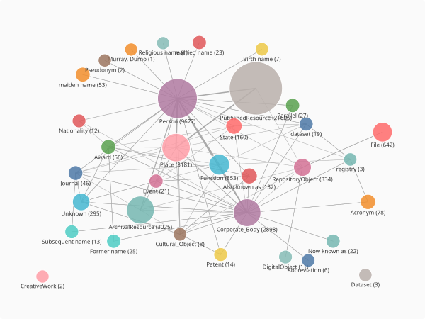
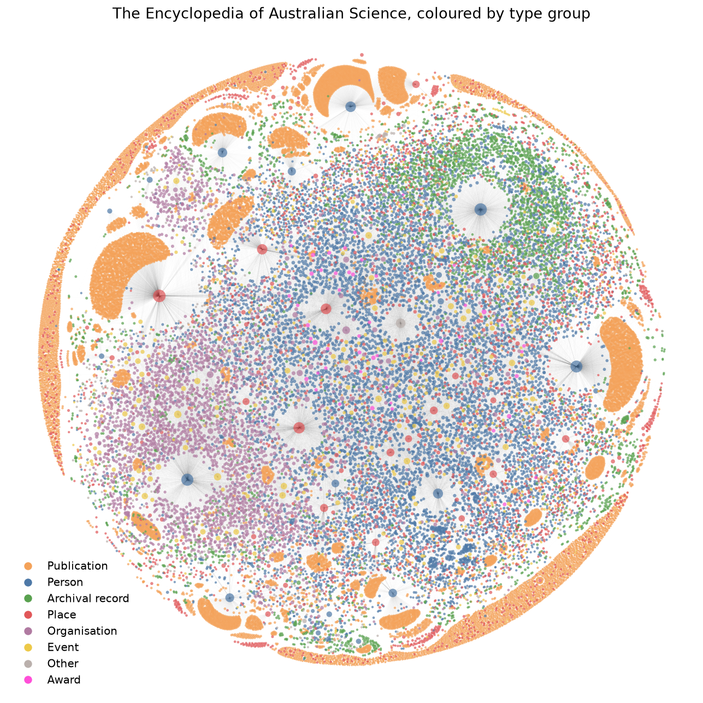
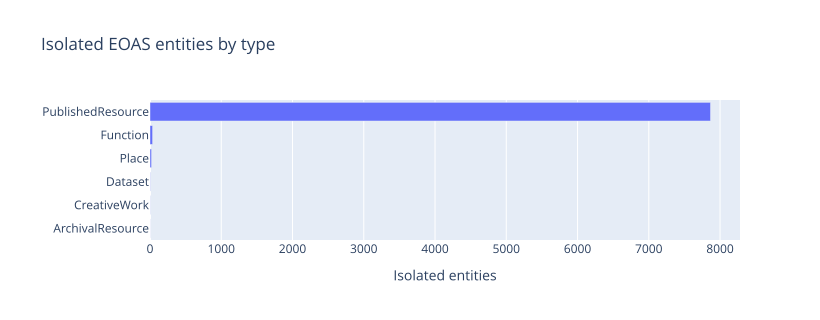
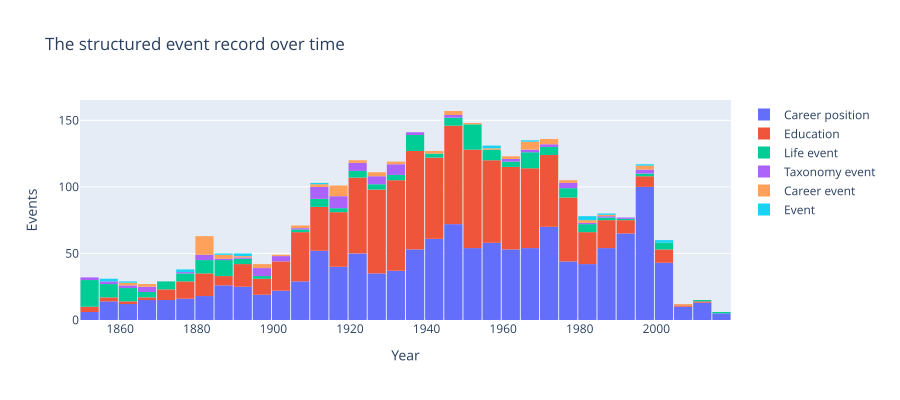
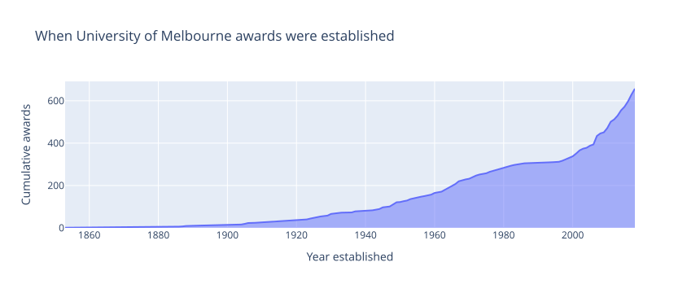
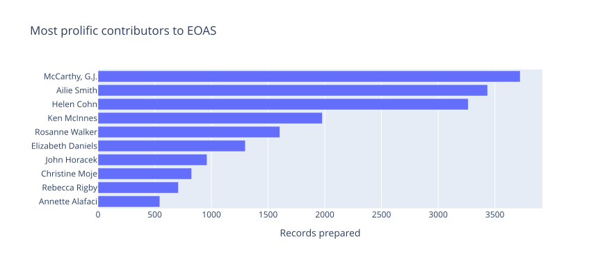
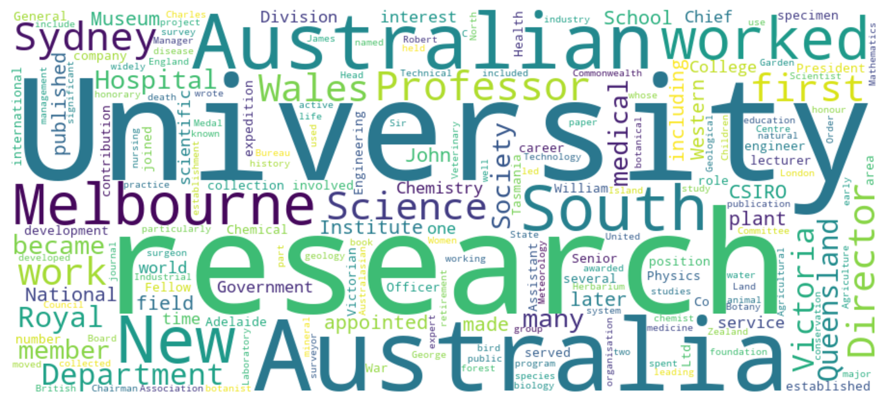

<!--
Case study. All code below was run against data/ohrm/EOASI2022-ro-crate (and
data/ohrm/UMPC-ro-crate for the awards section) on 2026-06-27; the outputs shown
are real. Figures render to docs/assets/eoas-questions-* (see the scratchpad
build scripts build_eoas2.py and full_render.py for the full-graph image);
regenerate them if the crate or code changes. The
Wikidata result in the final section is live and may change. The questions
worked through here come from discussion notes with Gavan McCarthy.
-->

# Navigating the Encyclopedia of Australian Science

The [Encyclopedia of Australian Science and Innovation](https://www.eoas.info/) (EOAS) is a
long-running reference work documenting the people, organisations, and published record of
Australian science. Saved as an RO-Crate, it becomes a graph of more than 43,000 entities and
95,000 relationships that we can question directly.

This case study works through a set of research questions raised in discussion with Gavan
McCarthy, a figure in Australian archival science. The questions cluster into four areas:
the *quality* of the data and the links within it, its shape *in time*, the *awards and
authorship* it records, and how it might connect to the *wider world* beyond the collection.
We take each in turn, drawing together techniques introduced separately across the tutorials.
One detail to watch for: the collection turns out to have a good deal to say about the people
who built it, Gavan among them.

## What you'll learn

- How much of a collection sits disconnected, and how two collections compare.
- How completely a kind of detail, such as birthplaces, has been recorded.
- The alternative names a collection already holds for the same person.
- How to move from a single date to an event's surroundings, read the shape of a collection's event
  record over time, and view a whole period as a network.
- How to trace a collection's own history: when its awards were founded and who compiled it.
- How to read what the collection writes about, and put faces to its records.
- How to connect a person in the collection to the wider web of linked data.

## Running this tutorial

While `crategraph` is pre-release, launch from the repository root with `uv run`, pulling in the
project plus the plotting and text dependencies used below:

```bash
uv run --all-extras --with jupyter,pandas,plotly,kaleido,wordcloud,matplotlib jupyter notebook
```

## 1. Load the collection and get an overview

```python
from crategraph import Crate

eoas = Crate("data/ohrm/EOASI2022-ro-crate")
eoas
```

```
Graph(43255 entities, 95052 relationships, source='data/ohrm/EOASI2022-ro-crate')
```

```python
eoas.summary()
```

```
=== Graph Summary ===
Source: data/ohrm/EOASI2022-ro-crate
Entities: 43255 | Relationships: 95052

Entity types:
  PublishedResource, JournalArticle  9864  ▒▒▒▒▒▒▒▒▒▒▒▒▒▒▒
  Person                             6370  ▒▒▒▒▒▒▒▒▒▒
  Place                              3181  ▒▒▒▒▒
  ArchivalResource                   3025  ▒▒▒▒▒
  PublishedResource, Book            3011  ▒▒▒▒▒
  PublishedResource, BookSection     3008  ▒▒▒▒▒
  Corporate_Body                     2892  ▒▒▒▒
  PublishedResource, ResourceSection 1976  ▒▒▒
  Person, Career position            1324  ▒▒
  ...

Relationship types:
  preparedBy      20015  ▒▒▒▒▒▒▒▒▒▒▒▒▒▒▒
  Related         14651  ▒▒▒▒▒▒▒▒▒▒▒
  Relationship    13903  ▒▒▒▒▒▒▒▒▒▒
  place            8533  ▒▒▒▒▒▒
  birthPlace       5890  ▒▒▒▒
  birthState       5400  ▒▒▒▒
  Primary          3533  ▒▒▒
  deathPlace       2563  ▒▒
  nationality      1413  ▒
  alsoKnownAs      1370  ▒
  ...

Most connected: Melbourne (3983), McCarthy, G.J. (3723), Ailie Smith (3435), Helen Cohn (3264), Victoria (2327)
```

Two things stand out. The collection is dominated by *published resources* (journal articles,
books, book sections) describing the work of *people* and *organisations*, anchored to *places*.
And the busiest relationship by far is `preparedBy`: the record of who entered each item. The
"Most connected" line already hints at the reflexive theme. After Melbourne, the second most
connected node in the whole collection is a person, `McCarthy, G.J.`, who prepared thousands of
records. We return to that in section 9.

```python
eoas.glimpse()
```



`glimpse()` collapses the crate to one node per type, sized by how many entities it holds and
linked by the relationships between types, so the broad structure is visible at a glance before
we drill in.

### Grouping the types into broader categories

The glimpse already hints that EOAS has a sprawling type system. `entity_counts("type")` confirms
it:

```python
len(eoas.entity_counts("type"))
```

```
34
```

Thirty-four types is a lot to hold in mind, and many are fine distinctions: a `Book`, a
`BookSection`, and a `JournalArticle` are all published resources; a `maiden name` and a
`married name` are both name variants. When we want the big picture rather than the detail, we can
bin the types into a handful of broad categories with a plain dictionary, then annotate each entity
with its group:

```python
TYPE_GROUPS = {
    "PublishedResource": "Publication", "Journal": "Publication", "Patent": "Publication",
    "Person": "Person",
    "Corporate_Body": "Organisation",
    "Place": "Place", "State": "Place",
    "ArchivalResource": "Archival record", "RepositoryObject": "Archival record",
    "File": "Archival record",
    "Event": "Event", "Function": "Event",
    "Award": "Award",
}

binned = eoas.annotate_entities(
    type_group=lambda e: TYPE_GROUPS.get(e.type.split(",")[0], "Other"),
)
binned.entity_counts("type_group")
```

```
[{'type_group': 'Publication', 'count': 21665},
 {'type_group': 'Person', 'count': 9677},
 {'type_group': 'Archival record', 'count': 4001},
 {'type_group': 'Place', 'count': 3341},
 {'type_group': 'Organisation', 'count': 2898},
 {'type_group': 'Event', 'count': 874},
 {'type_group': 'Other', 'count': 743},
 {'type_group': 'Award', 'count': 56}]
```

The dictionary maps each entity's primary type to a group, and anything not listed (the name
variants, acronyms, and miscellany) falls through to `"Other"`. `type_group` is now an ordinary
property, usable anywhere a native one would be: in `where()`, or as a colour in `visualise()`.
Colouring the whole graph by it turns the collection into a readable map rather than the jumble the
raw types would produce:

```python
binned.visualise(renderer="2d", colour_by="type_group", size_by="connections",
                 filepath="eoas-by-group.html")
```



Even at this scale the structure is readable. The blue hubs are the prolific people of section 9,
each trailing a fan of the orange publications they prepared; the green mass is the archival record;
the purple band is the organisations; and places (red) and awards (magenta) punctuate the rest. This
is the whole collection, not a type-level summary like `glimpse()`: every one of the 43,000 entities
is a dot, just coloured by the handful of groups instead of by its exact type.

(At this size the interactive page is heavy, so the figure above is a static render of the same
graph.)

## Part A: Data quality and curation

The first cluster of questions is curatorial. Which records stand alone? Where are links likely
missing? And are the same people recorded under more than one name?

### 2. Which entities stand alone?

An *isolated* entity is one with no relationships at all. `select(max_connections=0)` keeps
exactly those, and is a quick gauge of how much of a collection sits disconnected. The question
was posed across two collections, EOAS and the University of Melbourne Perpetual Calendar (UMPC),
so we load both at once and compare them, one source at a time:

```python
corpus = Crate("data/ohrm/EOASI2022-ro-crate", "data/ohrm/UMPC-ro-crate")

for source in corpus.sources:
    total = len(corpus.select(source=source).entities)
    alone = len(corpus.select(source=source, max_connections=0).entities)
    print(f"{source}: {alone:,} of {total:,} isolated ({alone / total:.0%})")
```

```
EOASI2022-ro-crate: 7,931 of 43,255 isolated (18%)
UMPC-ro-crate: 1,222 of 4,270 isolated (29%)
```

Both collections carry a substantial disconnected tail: roughly a fifth of EOAS and over a
quarter of UMPC. To see what that tail is made of, count the isolated EOAS entities by type.
`entity_counts()` does the counting for us:

```python
isolated = eoas.select(max_connections=0)
isolated.entity_counts("type")
```

```
[{'type': 'PublishedResource', 'count': 7866},
 {'type': 'Function', 'count': 37},
 {'type': 'Place', 'count': 22},
 {'type': 'Dataset', 'count': 3},
 ...]
```



Almost the entire isolated set is published resources: items recorded in the bibliography but not
yet linked to the person or organisation they concern. That is a precise, actionable finding for
a curator. The disconnected tail is not scattered noise but one fixable kind of gap, and the
list of those resources is the worklist. We can hand it to a curator as a spreadsheet in two
steps: turn the isolated entities into records, then write them to CSV:

```python
import pandas as pd

records = isolated.entity_records()
pd.DataFrame(records).to_csv("eoas_isolated_resources.csv", index=False)
```

### 3. Where are connections missing?

Isolation is the extreme case. A subtler question is where links are *thin*: among entities that
could carry a given relationship, how many actually do? Biographical detail is a good test. Of all
the people in the collection, how many have a recorded birthplace?

We add a flag to every entity with `annotate_entities()`, then count it. The flag is computed on
the whole graph, because once we narrow to people alone the `birthPlace` links (which point from
a person to a place) would no longer be in view:

```python
people = eoas.annotate_entities(
    has_birthplace=lambda e: e.has("birthPlace"),
).select(entity_types=["Person"])

people.entity_counts("has_birthplace")
```

```
[{'has_birthplace': False, 'count': 5820},
 {'has_birthplace': True, 'count': 3857}]
```

So 3,857 of the 9,677 people, two in five, have a recorded birthplace. Whether that counts as
good coverage depends on the collection's goals, but the figure turns a vague worry ("are the
biographies complete?") into a number to track as curation continues. The same `e.has(...)` flag
measures coverage of any relationship: swap in `deathPlace`, `nationality`, or `preparedBy`.

### 4. Variant names and duplicate creators

People appear in historical sources under many names: maiden and married names, initials,
anglicised spellings. EOAS already curates many of these as `alsoKnownAs` links. We can surface
them by following that relationship inward to each person. We annotate two things, the joined-up
variant names and a count of them, then keep the people who have at least one:

```python
named = eoas.annotate_entities(
    also_known_as=lambda e: e.related("alsoKnownAs", direction="in").join("name"),
    variant_count=lambda e: len(e.related("alsoKnownAs", direction="in")),
).select(entity_types=["Person"]).where(variant_count=(1, 1000))

print(f"{len(named.entities)} people have a recorded name variant")
named.entity_records(columns=["label", "also_known_as"])[:5]
```

```
261 people have a recorded name variant
```

```
[{'label': 'Croll, Joan (Una)',          'also_known_as': 'Croll, Una'},
 {'label': 'Serventy, Carol',            'also_known_as': 'Darbyshire, Carol'},
 {'label': 'Bornemissza, George Francis','also_known_as': 'Bornemissza, György Ferenc'},
 {'label': 'Greig, Jane Stocks',         'also_known_as': 'Greig, Jean'},
 {'label': 'Vickers-Rich, Patricia',     'also_known_as': 'Vickers, Patricia'}]
```

`where(variant_count=(1, 1000))` keeps people whose count falls in that range, so we list only
those with a variant. The pairs show exactly the cases curators care about: maiden names
(Serventy, born Darbyshire), anglicised forms (Bornemissza, György to George), and shortened
forms.

These are variants the collection already knows about. The harder task is finding likely
duplicates that are *not* yet linked. Comparing every name against every other does not scale to
ten thousand people, but a targeted `search()` in fuzzy mode is cheap and is how a curator would
actually work: take a surname and see everything close to it.

```python
eoas.search("Bragg", mode="fuzzy", top_n=4)
```

```
Found 164 matches for "Bragg":

  100  #ASBS01737  (name: William and Lawrence Bragg)
  100  #ASBS01922  (author: McCarthy, Gavan; Bragg, Ken)
  100  #ASBS03597  (name: William H. Bragg and William L. (Lawrence) Bragg: A Guide ...)
  100  #ASBS04791  (name: Braggs' law or Bragg's law?)
  ... and 160 more
```

The matches gather every mention of the Braggs across people, archival resources, and published
works, the raw material for deciding which records refer to the same person and should be linked.

## Part B: Reading the collection in time

EOAS dates are already normalised to ISO form, which makes the collection easy to read in time.
We start with a single day, then widen the lens to a whole period.

### 5. What happened on this day?

`convert_dates()` reads each entity's messy date fields and writes tidy `start_date`, `year`, and
related columns. With a real `start_date` to hand, the day of the year is just its last five
characters (`MM-DD`), so finding everyone born on a given day takes one short annotation:

```python
dated = eoas.select(entity_types=["Person"]).convert_dates(report=False)

calendar = dated.annotate_entities(
    month_day=lambda e: (e.get("start_date") or "")[5:] or None,
)
on_17_june = calendar.where(month_day="06-17")
print(f"{len(on_17_june.entities)} people born on 17 June")
```

```
12 people born on 17 June
```

`where(month_day="06-17")` filters to that one calendar day. The result is a small subgraph we can
read as a table, sorted by birth year (which `convert_dates()` also gave us):

```python
table = pd.DataFrame(
    on_17_june.entity_records(columns=["label", "year"])
).dropna(subset=["year"]).astype({"year": int}).sort_values("year")
table
```

```
                                label  year
                    Blaxland, Gregory  1778
Schleinitz, Georg Gustav Freiherr Von  1834
                Walton, Thomas Utrick  1852
                     Poate, Frederick  1855
               Leighton, Arthur Edgar  1873
              Herbert, Andrew Desmond  1898
                   East, Lewis Ronald  1899
          Stewart, George Alan (Alan)  1922
             Sutherland, Struan Keith  1936
                 Burrows, Graham Dene  1938
                      Sloan, Ian Hugh  1938
                   Adams, Jerry McKee  1940
```

From here we can navigate outward from any one of them. `expand(depth=1)` grows a single entity
into its immediate neighbourhood, the people, places, and works recorded around it:

```python
leighton = next(e for e in on_17_june.entities if e.name.startswith("Leighton"))
neighbourhood = eoas.select(id=leighton.id).expand(depth=1)
neighbourhood.visualise(renderer="2d", colour_by="type", filepath="leighton.html")
```

<iframe src="../../assets/eoas-questions-leighton.html" width="100%" height="480"
        style="border:none" loading="lazy" title="Arthur Edgar Leighton's neighbourhood"></iframe>

The chart is interactive: drag nodes, hover for labels, and follow the links from Leighton out to
the works and places attached to him.

### 6. The shape of the event record

Those lives are recorded not only as birth dates but as *structured events*: the career positions
people held, their education, and notable life and taxonomy events. EOAS holds nearly three thousand
of them, and `convert_dates()` reads a year for almost every one. We gather the event entities, give
each a readable kind from its sub-type (`e.types[-1]`), and keep the dated ones:

```python
event_types = ["Career position", "Education", "Life event", "Taxonomy event", "Career event", "Event"]

events = (
    eoas.select(entity_types=event_types)
    .convert_dates(report=False)
    .annotate_entities(event_kind=lambda e: e.types[-1])
)

df = pd.DataFrame(events.entity_records(columns=["event_kind", "year"])).dropna(subset=["year"])
df["event_kind"].value_counts()
```

```
Career position    1322
Education          1067
Life event          243
Taxonomy event      101
Career event         87
Event                22
```

A histogram of those years, coloured by kind, shows the temporal shape of the event record:

```python
import plotly.express as px

fig = px.histogram(
    df[df["year"] >= 1850], x="year", color="event_kind", nbins=34,
    title="The structured event record over time",
    labels={"year": "Year", "event_kind": "Event kind"},
)
fig.update_layout(yaxis_title="Events", legend_title=None)
fig.show()
```



The record swells through the twentieth century to a peak around the 1940s, then thins sharply after
1980. Some of that fall-off is real history, and some is a gap in the record: events still in
progress, careers not yet ended, and recent lives not yet written up. Reading the shape this way is
itself a curatorial finding, showing where the event record is densest and where it tails off.

### 7. A period as a network

A single life is a small graph. A whole generation of science is a large one. Because dates are
normalised, we can ask for everything that falls within a time window and draw it. Here is the turn
of the twentieth century, 1880 to 1920:

```python
window = eoas.select(time_range=(1880, 1920))
window
```

```
Graph(5436 entities, 5318 relationships, source='data/ohrm/EOASI2022-ro-crate')
```

```python
window.entity_counts("type")[:5]
```

```
[{'type': 'Person', 'count': 3751},
 {'type': 'ArchivalResource', 'count': 1235},
 {'type': 'Corporate_Body', 'count': 416},
 {'type': 'Journal', 'count': 14},
 {'type': 'Former name', 'count': 7}]
```

Over three thousand people, a thousand archival resources, and the organisations linking them: a
substantial slice of Australian science across four decades. Before drawing it, `most_connected()`
tells us what holds the period together by ranking entities on how many links they have:

```python
for entity, degree in window.most_connected(n=8):
    print(f"{degree:3}  {entity.type:15}  {entity.name}")
```

```
 59  Corporate_Body   National Herbarium of Victoria
 52  Corporate_Body   Royal Australasian Ornithologists' Union
 50  Person           Mueller, Ferdinand Jakob Heinrich von
 44  Corporate_Body   Royal Society of South Australia
 38  Corporate_Body   The Field Naturalists Club of Victoria Inc
 38  Award            Mueller Medal
 35  Corporate_Body   Institution of Engineers, Australia
 30  Corporate_Body   National Museum of Victoria
```

The learned societies, museums, and herbaria (and the botanist Ferdinand von Mueller, with a medal
named after him) are the hubs around which the period organised itself. But not everything connects.
This window picks up the data-quality thread from Part A: among these 5,436 entities are many with
no links at all. We flag each as `connected` or `isolated`, count the split, and colour the network
by it:

```python
isolated_ids = {e.id for e in window.select(max_connections=0).entities}
flagged = window.annotate_entities(
    connectivity=lambda e: "isolated" if e.id in isolated_ids else "connected",
)
flagged.entity_counts("connectivity")
```

```
[{'connectivity': 'connected', 'count': 3502},
 {'connectivity': 'isolated', 'count': 1934}]
```

```python
flagged.visualise(renderer="2d", colour_by="connectivity", simple=True,
                  filepath="turn-of-century.html")
```

<iframe src="../../assets/eoas-questions-decade-network.html" width="100%" height="600"
        style="border:none" loading="lazy" title="EOAS network, 1880 to 1920, by connectivity"></iframe>

`colour_by` accepts any property, including a derived one like our `connectivity` flag, so the
network comes out in two colours: the connected core in blue and the isolated records in orange.
The force-directed layout has nothing to pull the disconnected records inward, so they settle around
the outside, a literal picture of the disconnected tail measured in section 2, now seen for one
period rather than the whole collection.

## Part C: Awards and authorship

### 8. When were the awards established?

Gavan's award question was about the UMPC collection, whose statutes record the scholarships,
prizes, and fellowships the University of Melbourne has established over its history.
`convert_dates()` reads the year each was founded, and we add its kind from the `function`
property:

```python
umpc = Crate("data/ohrm/UMPC-ro-crate")

awards = (
    umpc.select(entity_types=["Regulations_and Statutes"])
    .convert_dates(report=False)
    .annotate_entities(kind=lambda e: e.get("function") or "Other")
)
awards.entity_counts("kind")[:6]
```

```
[{'kind': 'Scholarship', 'count': 259},
 {'kind': 'Other', 'count': 78},
 {'kind': 'Research Fund', 'count': 57},
 {'kind': 'Prize', 'count': 36},
 {'kind': 'Bursary', 'count': 28},
 {'kind': 'Memorial, Scholarship', 'count': 28}]
```

Scholarships dominate, followed by research funds, prizes, and bursaries. To see when they were
founded, we put the records in a DataFrame, count how many existed up to each year, and draw the
running total as a filled area with Plotly Express:

```python
import plotly.express as px

awards_df = (
    pd.DataFrame(awards.entity_records(columns=["label", "kind", "year"]))
    .dropna(subset=["year"]).astype({"year": int})
)
cumulative = awards_df.groupby("year").size().cumsum().reset_index(name="cumulative")

px.area(
    cumulative, x="year", y="cumulative",
    title="When University of Melbourne awards were established",
    labels={"year": "Year established", "cumulative": "Cumulative awards"},
)
```



The curve is slow through the nineteenth century and steepens sharply from the 1960s, with the
fastest growth in the most recent decades, the visible trace of a university expanding its honours
as it grew.

### 9. Who built the collection?

The `preparedBy` relationship records who entered each item. To rank contributors we do not need
to loop over people at all: we keep just the `preparedBy` relationships and count them by their
target, the person who did the preparing. `relationship_counts()` does this directly:

```python
prepared = eoas.select(relationship_types=["preparedBy"])
prepared.relationship_counts("target")[:5]
```

```
[{'target': '#McCarthy, G.J.', 'count': 3723},
 {'target': '#Ailie Smith',    'count': 3435},
 {'target': '#Helen Cohn',     'count': 3264},
 {'target': '#Ken McInnes',    'count': 1977},
 {'target': '#Rosanne Walker', 'count': 1603}]
```

The targets are entity ids (the leading `#` marks an id); stripping it gives the contributor's
name for a chart:

```python
counts = pd.DataFrame(prepared.relationship_counts("target")).head(10)
counts["contributor"] = counts["target"].str.lstrip("#")

px.bar(
    counts.iloc[::-1], x="count", y="contributor", orientation="h",
    title="Most prolific contributors to EOAS",
    labels={"count": "Records prepared", "contributor": ""},
)
```



This is the reflexive turn promised at the start. The collection records its own making, and the
most prolific contributor, with 3,723 records, is `McCarthy, G.J.`, the same Gavan McCarthy whose
questions this case study follows. A handful of contributors account for a large share of the
collection, a common and important pattern for understanding how an archive came to be, and whose
editorial judgement shaped it.

## Part D: The words and faces of the collection

So far we have read the collection's structure and its dates. It also holds a great deal of
biographical prose and several hundred images, which we can read in aggregate.

### 10. What the collection writes about

Every person carries a `summaryNote`, a short biography. `text_records()` gathers that text,
keeping each record's provenance, the same handoff used in the
[NLP tutorial](../tutorials/basic-nlp-with-text-records.ipynb). We join the biographies into one
body of text and let a word cloud show what recurs:

```python
texts = eoas.select(entity_types=["Person"]).text_records(
    source_kind="properties", text_properties=["summaryNote"])
biographies = " ".join(record["text"] for record in texts)
print(f"{len(biographies):,} characters of biographical text")
```

```
2,621,128 characters of biographical text
```

```python
from wordcloud import STOPWORDS, WordCloud
import matplotlib.pyplot as plt

stopwords = STOPWORDS | {"Person", "summaryNote", "born", "died", "year", "years"}
cloud = WordCloud(width=900, height=400, background_color="white",
                  stopwords=stopwords, colormap="viridis",
                  collocations=False).generate(biographies)

plt.imshow(cloud, interpolation="bilinear")
plt.axis("off")
plt.show()
```



The cloud reads like the shape of a scientific life: `University`, `research`, `Professor`,
`Science`, and the institutions (`Royal`, `Institute`, `Director`) where careers played out, set
against the handful of places, Melbourne, Sydney, New South Wales, Victoria, that recur across the
biographies. It is a quick, aggregate sense of what the collection is about, and a starting point
for the closer text analysis the NLP tutorial covers.

### 11. Putting faces to the records

The collection also holds digitised images, many of them portraits. `gallery()` lays out the
image files as a thumbnail grid. Each image file links to a descriptive record through the
`dobject` relationship, so we borrow that record's title as the caption (computed on the full
graph, before narrowing to the image files):

```python
images = (
    eoas.annotate_entities(
        is_jpg=lambda e: e.id.lower().endswith(".jpg"),
        title=lambda e: e.related("dobject", direction="out").join("name") or e.label,
    )
    .select(entity_types=["File"])
    .where(is_jpg=True)
)
print(f"{len(images.entities)} image files")
images.gallery(caption="title", columns=4, limit=12, filepath="gallery.html")
```

```
303 image files
```

<iframe src="../../assets/eoas-questions-gallery.html" width="100%" height="560"
        style="border:none" loading="lazy" title="A gallery of EOAS portraits"></iframe>

The portraits put faces to names that have so far been only nodes and labels, a reminder that the
graph stands in for real people and real scientific lives.

## Part E: Beyond the collection

### 12. From Lucy Meredith Bryce to the wider world

The last question looks outward. Can an entity in the collection be connected to external
knowledge graphs, to enrich it and discover links the collection does not record? Gavan's example
was Lucy Meredith Bryce, an Australian haematologist. We first locate her local neighbourhood,
then reach out to Wikidata.

`search()` finds her records, and `expand(depth=1)` gathers what the collection links to her:

```python
bryce_network = eoas.search("Lucy Meredith Bryce", top_n=10).expand(depth=1)
bryce_network.visualise(renderer="2d", colour_by="type", filepath="bryce.html")
```

<iframe src="../../assets/eoas-questions-bryce.html" width="100%" height="480"
        style="border:none" loading="lazy" title="Lucy Meredith Bryce's neighbourhood"></iframe>

That is what the collection knows. To reach beyond it, we query Wikidata's search API for her name.
This step needs network access, so we wrap it so the rest of the notebook still runs offline:

```python
import json, urllib.parse, urllib.request

def wikidata_lookup(label, limit=5):
    url = ("https://www.wikidata.org/w/api.php?action=wbsearchentities"
           f"&format=json&language=en&limit={limit}&search={urllib.parse.quote(label)}")
    request = urllib.request.Request(url, headers={"User-Agent": "crategraph-demo/0.1"})
    with urllib.request.urlopen(request, timeout=10) as response:
        return json.load(response).get("search", [])

try:
    for match in wikidata_lookup("Lucy Meredith Bryce"):
        print(match["id"], "|", match.get("label"), "|", match.get("description"))
except Exception as error:
    print(f"Wikidata lookup skipped ({type(error).__name__}); this step needs network access.")
```

```
Q3266001 | Lucy Bryce | Australian haematologist and physician (1897-1968)
```

The single confident match, `Q3266001`, with dates (1897 to 1968) and a description that align with
the EOAS biographical entry, is the bridge between the two systems. From a confirmed Wikidata
identifier you can pull birthplaces, fields of work, awards, and links to other people, then fold
the new facts back into the crate as fresh relationships. The same lookup, run across the people in
a collection, is a path to entity resolution and enrichment at scale.

## Upcoming

A few of the questions raised with Gavan point further than this case study reaches, and make
natural next steps:

- **Suggesting candidate links.** Section 3 measures where relationships are *thin*, but it does not
  yet propose *which* specific links to add. Similarity or shared-neighbour analysis (two
  unconnected people who share many of the same colleagues, places, or works are plausibly
  connected) could surface candidate relationships for a curator to review, turning a measurement
  of absence into concrete suggestions.
- **Beyond Wikidata.** Section 12 resolves one person against Wikidata; the same approach extends to
  Wikipedia, DBpedia, and other linked-data sources, and to running the lookup across a whole
  collection for systematic enrichment.
- **Authorship over time.** Section 9 ranks contributors overall; tracking each contributor's output
  by year would show how the editorial effort changed hands across the decades.
