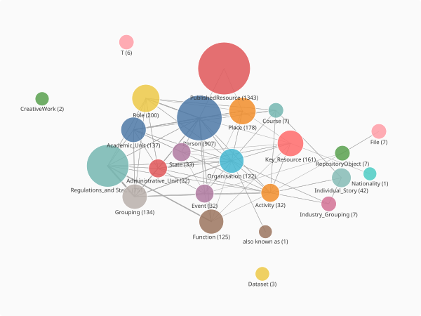

# crategraph cheat sheet

A quick tour of `crategraph`'s basics: loading a crate, exploring its entities and
relationships, filtering and transforming the graph, and visualising the result.

> Inspired by Franz Diebold's Polars cheat sheet.

## Before we begin

A crate loaded with `crategraph` is a **`Graph`** made of two layers of data:

```
        ENTITY (node)                 RELATIONSHIP (edge)
        ┌──────────────┐  --type-->   ┌──────────────────┐
        │ .id  .types  │  ══════════>  │ .type            │
        │ .properties  │              │ .source  .target │
        │ .name        │              │ .properties      │
        └──────────────┘              └──────────────────┘
              │                                │
     filter by PROPERTIES              filter by STRUCTURE
        crate.where(...)                 crate.select(...)
```

The layer you query must match the method:

| Filtering by… | Method | Example |
|---|---|---|
| a value *on a node* (name, year, nationality) | `where` | `crate.where(name="Smith")` |
| a *type* or *edge* (entity types, relationship types) | `select` | `crate.select(relationship_types="Primary")` |

For example, `where(relationship_types="Primary")` returns **0** results: it looks for a node
*property* literally called `relationship_types`, which does not exist.

Every filter and transform returns a **new `Graph`**, so they chain.

We will explore the package on a real crate below.

### Case study: the University of Melbourne Perpetual Calendar (UMPC)

We use the **University of Melbourne Perpetual Calendar (UMPC)** crate, from the
[OHRM Upload Project](https://figshare.unimelb.edu.au/projects/OHRM_Upload_Project/230466).
Source: [umpc.esrc.unimelb.edu.au](https://umpc.esrc.unimelb.edu.au/index.html).

## Running this tutorial

While `crategraph` is pre-release, launch from the repository root with `uv run`, pulling in
the project plus the plotting dependencies:

```bash
uv run --all-extras --with jupyter --with pandas jupyter notebook
```

## 1. Load a graph

Load a crate (RO-Crate) from a local directory containing `ro-crate-metadata.json`:

```python
from crategraph import Crate

crate = Crate("experiments/crates/UMPC")
crate
```

```
Graph(4270 entities, 12601 relationships, source='experiments/crates/UMPC')
```

A few load-time options:

```python
Crate(p1, p2)                       # load several crates (IDs prefixed by directory name)
Crate(path, include_root=True)      # keep the root Dataset entity as a node
Crate(path, inline_relations=False) # only reified Relationship entities become edges
```

## 2. Get a feel for the crate

A summary of the graph, including the full list of entity types and relationship counts:

```python
crate.summary()
```

```
=== Graph Summary ===
Source: experiments/crates/UMPC
Entities: 4270 | Relationships: 12601

Entity types:
  PublishedResource, Resource                  1068  ▒▒▒▒▒▒▒▒▒▒▒▒▒▒▒
  Regulations_and Statutes                      751  ▒▒▒▒▒▒▒▒▒▒▒
  Person                                        554  ▒▒▒▒▒▒▒▒
  Person, University of Melbourne               317  ▒▒▒▒
  Role                                          200  ▒▒▒
  ...
```

Structural stats: density, components, connectivity and the connection distribution:

```python
crate.profile()
```

```
=== Graph Profile ===
Source: experiments/crates/UMPC
Entities: 4270 | Relationships: 12601
Density: 0.0007
Types: 54 entity, 17 relationship

Entity types:
  PublishedResource         1343  ▒▒▒▒▒▒▒▒▒▒▒▒▒▒▒
  Person                     907  ▒▒▒▒▒▒▒▒▒▒
  Regulations_and Statutes   751  ▒▒▒▒▒▒▒▒
  ...
```

Relationship coverage across entity types, useful for spotting data-quality gaps in the
RO-Crate metadata:

```python
crate.coverage()
```

```
[CoverageResult(Related source: 6/907 Person (1%)),
 CoverageResult(Related target: 6/907 Person (1%)),
 ...
 CoverageResult(Related source: 42/42 Individual_Story (100%))]
```

A visual snapshot of the graph, collapsed to a type-level overview:

```python
crate.glimpse()
```



## 3. Entities (nodes)

The items in a crate: people, files, places. Each has `.properties` (a data dictionary)
and a `.types` attribute.

Get your bearings: what does this graph contain?

```python
crate.entities          # list[Entity] of all nodes
```

Grab a single entity to look at. Indexing the list works (`crate.entities[0]`), but to pull
out a specific one, filter by an exact property such as its name:

```python
e = crate.where(name="UTR7.166 The Olga Lawless Ziegler Memorial Fund").entities[0]
e
```

```
Entity('Regulations_and Statutes', 'UTR7.166 The Olga Lawless Ziegler Memorial Fund', id='#E001213')
```

Get all file entities:

```python
crate.files
```

A sorted list of all entity type names present in the graph:

```python
list(crate.types)
```

```
['Academic_Unit', 'Activity', 'Administrative_Unit', 'Article', 'Book', 'BookSection', ...]
```

The number of entities (also visible in `.profile()`):

```python
len(crate)
```

```
4270
```

### Inspecting an individual entity

```python
print(e)
```

```
Entity('Regulations_and Statutes', 'UTR7.166 The Olga Lawless Ziegler Memorial Fund', id='#E001213')
```

Most of what you need is in `.properties`:

```python
e.properties
```

```
{'identifier': 'E001213',
 'name': 'UTR7.166 The Olga Lawless Ziegler Memorial Fund',
 'function': 'Scholarship',
 'processingNotes': '16 October 2018 Alannah Croom. Created entity',
 ...}
```

Get a specific entity by id (here reusing the id from the entity above):

```python
crate.get(e.id)
```

Get an entity together with its live reference to the graph. `EntityView` is what
`annotate_entities()` passes to your functions:

```python
e2 = crate.entity_view(e.id)
```

If anything is unclear, call `help()` on an object:

```python
help(e2)
```

### Discover all property keys

To see which property keys appear across the graph:

```python
sorted({k for e in crate.entities for k in e.properties})
```

### A count of distinct values

Return a count of distinct values for any property, sorted by count, descending:

```python
crate.entity_counts("function")
```

```
[{'function': 'Scholarship', 'count': 259},
 {'function': 'Research Fund', 'count': 57},
 {'function': 'Prize', 'count': 36},
 ...
 {'function': 'Lawyer', 'count': 13}, ...]
```

```python
crate.entity_counts("type")
```

```
[{'type': 'PublishedResource', 'count': 1343},
 {'type': 'Person', 'count': 907},
 {'type': 'Regulations_and Statutes', 'count': 751},
 ...]
```

### Filter by a property

Find all the lawyers in the graph:

```python
crate.where(function="Lawyer")
```

```
Graph(13 entities, 0 relationships, source='experiments/crates/UMPC')
```

Find all the entries within a date period (inclusive):

```python
crate.where(startDate=(1870, 1900))
```

```
Graph(70 entities, 130 relationships, source='experiments/crates/UMPC')
```

### Enrich

Suppose we want the people born in Victoria. Start by seeing what `Victoria` is linked to.
First, where is `birthPlace` pointing?

```python
crate.annotate_entities(
    place=lambda e: e.related("birthPlace").first("name")
).entity_counts("place")
```

```
[{'place': 'Melbourne', 'count': 19},
 {'place': 'University of Melbourne', 'count': 8},
 {'place': 'Sydney', 'count': 6}, ...]
```

```python
crate.annotate_entities(
    state=lambda e: e.related("birthState").first("name")
).entity_counts("state")
```

```
[{'state': 'Victoria', 'count': 98},
 {'state': 'New South Wales', 'count': 12}, ...]
```

Now that we know `Victoria` is the value of a `birthState`, we can add a new property to
entities and filter on it:

```python
crate2 = crate.annotate_entities(
    is_victorian=lambda e: e.related("birthState").first("name") == "Victoria"
)
len(crate2.where(is_victorian=True))
```

```
98
```

Find the top hub entities in the graph (10 by default; adjust `n`):

```python
crate.most_connected(n=3)
```

```
[(Entity('Regulations_and Statutes', 'Chapter R6, Prizes, Exhibitions, Scholarships and Bursaries', id='#E000100'), 417),
 (Entity('Function', 'Scholarship', id='#F000001'), 331),
 (Entity('Regulations_and Statutes', 'Chapter R7, Endowments Other Than Those of Prizes, Exhibitions and Scholarships', id='#E001373'), 321)]
```

## 4. Relationships (edges)

Directed links between entities. Each has a `.type`, `.source` and `.target`.

Look at what relationship types exist in the graph:

```python
list(crate.relationship_types)
```

```
['Previous', 'Primary', 'Related', 'Relationship', 'Subsequent', 'alsoKnownAs',
 'birthPlace', 'birthState', 'deathPlace', 'deathState', 'dobject', 'entity',
 'hasFile', 'nationality', 'place', 'preparedBy', 'relatedEvents']
```

Inspect a single relationship object:

```python
print(crate.relationships[111])
```

```
Relationship('#E000018' --deathState--> '#Victoria')
```

### Count

A count of how many relationships exist for each type, sorted by count, descending:

```python
crate.relationship_counts("type")
```

```
[{'type': 'Related', 'count': 9743},
 {'type': 'Relationship', 'count': 1249},
 {'type': 'entity', 'count': 358}, ...]
```

### Filter by edge type (use `select`)

Find entities connected by a `Primary` relationship:

```python
crate.select(relationship_types="Primary")
```

```
Graph(10 entities, 15 relationships, source='experiments/crates/UMPC')
```

You can match several relationship types at once:

```python
crate.select(relationship_types=["Previous", "Related"])
```

```
Graph(2206 entities, 9767 relationships, source='experiments/crates/UMPC')
```

`pattern()` matches by the relationship type on the edge. Everything connected via a
`preparedBy` edge (source or target):

```python
crate.pattern(via="preparedBy")
```

```
Graph(266 entities, 561 relationships, source='experiments/crates/UMPC')
```

### Enrich edges

`annotate_relationships()` derives a property per edge from a function that receives a
`RelationshipView` (with `.source`, `.target`, `.type`). For example, label each edge with
the entity types it connects, then count the type-to-type pairs:

```python
typed = crate.annotate_relationships(
    pair=lambda r: f"{r.source.type} -> {r.target.type}"
)
typed.relationship_counts("pair")
```

```
[{'pair': 'Regulations_and Statutes -> Regulations_and Statutes', 'count': 1507},
 {'pair': 'Grouping -> Regulations_and Statutes', 'count': 1170},
 {'pair': 'Person -> Person', 'count': 721}, ...]
```

`collapse_edges()` merges parallel edges between the same pair of nodes into single summary
edges, a quick way to thin a dense graph:

```python
collapsed = crate.collapse_edges()
len(crate.relationships), len(collapsed.relationships)
```

```
(12601, 7307)
```

## 5. File content

The data files attached to file-entities:

```python
len(crate.files)
```

```
10
```

## 6. Graph manipulations

Each manipulation returns a new graph.

### Filter / subset

Select a single entity type:

```python
people = crate.select(entity_types=["Person"])
```

```
Graph(907 entities, 721 relationships, source='experiments/crates/UMPC')
```

A time period:

```python
mid_cent = crate.select(time_range=(1945, 1960))
```

```
Graph(268 entities, 346 relationships, source='experiments/crates/UMPC')
```

The most connected entities:

```python
crate.select(min_connections=20)
```

```
Graph(79 entities, 128 relationships, source='experiments/crates/UMPC')
```

You can also leave information out. Exclude a relationship type:

```python
crate.exclude(relationship_types="Related")
```

```
Graph(3274 entities, 2858 relationships, source='experiments/crates/UMPC')
```

`drop()` removes the entities whose given property contains a value. Here we drop everything
prepared by the most prolific preparer, found from the data itself:

```python
preparer = crate.entity_counts("preparedBy")[0]["preparedBy"]   # '#Alannah Croom'
crate.drop(preparer, property="preparedBy")
```

```
Graph(4122 entities, 11466 relationships, source='experiments/crates/UMPC')
```

`drop()` returns 4122 entities, while the opposite `where()` returns 148. Together they make
up the original 4270:

```python
prepared = crate.where(preparedBy=preparer)
prepared
```

```
Graph(148 entities, 300 relationships, source='experiments/crates/UMPC')
```

Take the entities of one graph out of another with `subtract()`:

```python
crate.subtract(prepared)
```

```
Graph(4122 entities, 11466 relationships, source='experiments/crates/UMPC')
```

Free-text search for an entity. The default minimum rapidfuzz match score is 80; both the
threshold and the number of results are adjustable:

```python
crate.search("Elisabet")
```

```
Graph(120 entities, 73 relationships, source='experiments/crates/UMPC')
```

```python
crate.search("Elisabeth", threshold=90, top_n=3)
```

```
Graph(8 entities, 0 relationships, source='experiments/crates/UMPC')
```

### Transform

Raw string dates (like `"1985"`, `"c.1920s"`, or `"1 March 2003"`) can be parsed into ISO
date columns:

```python
crate.convert_dates()
```

```
convert_dates: parsed 1643/1643 entities with date fields (100%).
```

…or you can name the fields to read:

```python
crate.convert_dates(start="startDate", end="endDate")
```

`merge_nodes()` aggregates nodes by a property, returning a collapsed graph. Merging by
`type` gives a compact, type-level view: one node per type, each carrying a `count`, and
weighted type-to-type edges.

```python
overview = crate.merge_nodes(by="type")
overview
```

```
Graph(47 entities, 177 relationships, source='experiments/crates/UMPC')
```

```python
overview.get("Person").properties
```

```
{'label': 'Person', 'count': 554, 'merged_by': 'type'}
```

Add a `community` property to the graph with the Louvain algorithm (pass a `seed` for a
reproducible result):

```python
communities = crate.detect_communities(seed=42)
communities.entity_counts("community")
```

```
[{'community': 23, 'count': 772},
 {'community': 5, 'count': 470},
 {'community': 18, 'count': 344}, ...]
```

Then isolate the largest community:

```python
communities.where(community=23)
```

```
Graph(772 entities, 2687 relationships, source='experiments/crates/UMPC')
```

`expand()` grows a selection outward to include connected neighbours. Start from the 13
lawyers and pull in everything one hop away:

```python
lawyers = crate.where(function="Lawyer")   # 13 entities
lawyers.expand(depth=1)                      # 62 entities
```

`query()` matches a Cypher-style pattern and returns the matched subgraph. For example,
people with a recorded birthplace:

```python
crate.query("(a:Person)-[:birthPlace]->(b:Place)")
```

```
Graph(263 entities, ...)
```

## 7. Visualising and exporting

The default renderer for `visualise()` is `"2d"` (sigma.js, WebGL). Other options are `"3d"`
(3d-force-graph), `"svg"` (static SVG) and `"pyvis"` (vis.js, needs an extra install).

```python
crate.visualise(colour_by="type", filepath="umpc-network.html")
```

<iframe src="../../assets/umpc-cheatsheet-network.html" width="100%" height="560"
        style="border:none" loading="lazy" scrolling="no" title="UMPC crate network"></iframe>

The same call takes a `renderer` and styling options. These write standalone HTML files you
can open in a browser:

```python
crate.visualise(renderer="3d", filepath="umpc-3d.html")
crate.visualise(colour_by="community", size_by="year", filepath="umpc-styled.html")
```

Export GraphML to open the crate in Gephi or Cytoscape:

```python
crate.write("crate_export.graphml", format="graphml")
```

## Next steps

For a deeper, worked treatment of individual features, see the other
[tutorials](index.md), which cover [dates and timelines](exploring-temporal-dimensions.md),
[mapping places](mapping-collection-places.md), [visualisation](visualising-a-collection.md),
[search](searching-a-collection.md) and [exporting to DataFrames](from-graph-to-dataframe.md).
