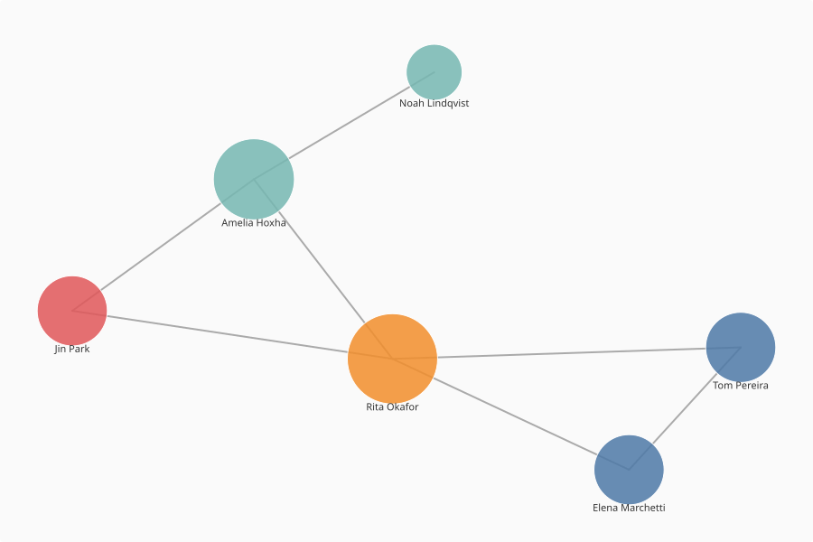

# From Graph to DataFrame

This tutorial walks through one common workflow: loading a crate, adding a couple of derived fields to the entities, filtering on one of them, and producing a pandas DataFrame and CSV from the result. We'll use a small example crate of six people across four decades.

## What you'll learn

- Getting a quick overview of a crate with `summary()`.
- Looking at the properties of a single entity to see what's available.
- Adding new fields to entities with `annotate_entities`.
- Using a derived field anywhere a native property would work, including in `where()` filters and in `visualise()`.
- Turning the entities into a pandas DataFrame and writing a CSV.

The example crate is at [`docs/tutorials/data/people-demo/`](https://github.com/unimelbmdap/cdl2-rocrates/tree/main/docs/tutorials/data/people-demo) in the repository. It has six people with birth dates spanning four decades, two organisations, and some `knows` connections between the people.

## 1. Load the crate

```python
from crategraph import Crate

crate = Crate("docs/tutorials/data/people-demo/")
crate
```

```
Graph(8 entities, 12 relationships, source='docs/tutorials/data/people-demo')
```

## 2. Get the lay of the land

```python
crate.summary()
```

```
=== Graph Summary ===
Source: docs/tutorials/data/people-demo
Entities: 8 | Relationships: 12

Entity types:
  Person        6  ▒▒▒▒▒▒▒▒▒▒▒▒▒▒▒
  Organisation  2  ▒▒▒▒▒

Relationship types:
  knows        7  ▒▒▒▒▒▒▒▒▒▒▒▒▒▒▒
  affiliation  5  ▒▒▒▒▒▒▒▒▒▒▒

Most connected: Rita Okafor (5), Amelia Hoxha (4), Elena Marchetti (3), Tom Pereira (3), Heritage Studies Centre (3)
```

Six people, two organisations, and two kinds of connection: `affiliation` from a person to their organisation, and `knows` between people.

## 3. Look at a person's properties

Before we add any new fields, it helps to see what's already there. Pick any person and look at their properties:

```python
crate.select(entity_types=["Person"]).entities[0].properties
```

```
{'name': 'Elena Marchetti', 'birthDate': '1962-03-04', 'affiliation': '#org-heritage', 'knows': ['#person-tom', '#person-rita']}
```

That gives you a feel for what each person carries. Different people may have slightly different sets of properties. Elena has an `affiliation`, but not every person does. To see every property name that appears anywhere across the people, collect them as you loop through:

```python
all_names = set()
for person in crate.select(entity_types=["Person"]).entities:
    all_names.update(person.properties)
sorted(all_names)
```

```
['affiliation', 'birthDate', 'knows', 'name']
```

In the next step we'll add a new field that's the same for everyone.

## 4. Add a derived field with `annotate_entities`

`birthDate` is a string. To group people by decade, sort them chronologically, or compute an age, we want it as a number we can do arithmetic with. crategraph has native temporal accessors that parse date properties for you, so there's no need to pick the string apart by hand. `annotate_entities` adds a new field to every entity, calculated from a small function we provide:

```python
people = crate.select(entity_types=["Person"]).annotate_entities(
    birth_year=lambda e: e.parse_year("birthDate"),
)
```

The `lambda e: ...` part is just Python's compact way of writing a one-line function. It's called once per person; `e` is the person, and `e.parse_year("birthDate")` reads their `birthDate` property and returns the year as an integer. It's safe on missing or malformed dates: it returns `None` rather than raising.

`parse_year` is one of crategraph's temporal accessors. For the full parsed value, with start and end dates, precision, and `circa`/`uncertain` flags, use `e.parse_date("birthDate")`, which returns a `TemporalValue`. When a crate stores dates in standard fields, the `e.year` and `e.start_date` properties read them automatically without you naming a field.

`annotate_entities` returns a new graph (it doesn't modify the original), so we save it as `people`.

The same approach works for many other kinds of derived field, for example:

- **Flags based on connections**: mark which people have any affiliation, with `has_affiliation=lambda e: e.has("affiliation")`.
- **Tidy categories**: collapse a free-text `role` property into a smaller set of standard values.
- **Display labels**: combine `givenName` and `familyName` into one `display_name`.

## 5. Add a second annotation that uses the first

Now that `birth_year` is a number, the decade is one short expression away.

```python
people = people.annotate_entities(
    decade_born=lambda e: (e.get("birth_year") // 10) * 10,
)
```

`e.get("birth_year")` returns the year we computed in step 4. `// 10 * 10` rounds it down to the start of the decade (1962 → 1960, 1991 → 1990).

## 6. Colour a visualisation by the new field

Derived fields can be used the same way as any other property. `visualise()` has a `colour_by` argument that takes a property name, so we can pass the new `decade_born` field directly:

```python
people.visualise(
    renderer="svg",
    colour_by="decade_born",
    width=900,
    height=600,
    filepath="people-by-decade.svg",
)
```



| Decade | Colour |
|--------|--------|
| 1960s  | <span style="display:inline-block;width:0.9em;height:0.9em;background:#4e79a7;border-radius:50%;vertical-align:middle"></span> blue |
| 1970s  | <span style="display:inline-block;width:0.9em;height:0.9em;background:#f28e2b;border-radius:50%;vertical-align:middle"></span> orange |
| 1980s  | <span style="display:inline-block;width:0.9em;height:0.9em;background:#e15759;border-radius:50%;vertical-align:middle"></span> red |
| 1990s  | <span style="display:inline-block;width:0.9em;height:0.9em;background:#76b7b2;border-radius:50%;vertical-align:middle"></span> teal |

Each node is sized by how many connections it has, so Rita and Amelia, who have the most `knows` edges, show up largest.

## 7. Filter on the derived field

`where()` filters by property value, and our new `decade_born` field is just another property, so we can filter on it directly:

```python
nineties = people.where(decade_born=1990)
nineties
```

```
Graph(2 entities, 1 relationships, source='docs/tutorials/data/people-demo')
```

Two people, with one `knows` edge between them.

## 8. Build a DataFrame and write a CSV

`entity_records()` returns a list of dictionaries (one per entity) that pandas understands directly:

```python
import pandas as pd

df = pd.DataFrame(people.entity_records()).sort_values("birth_year").reset_index(drop=True)
df[["label", "birthDate", "birth_year", "decade_born"]].head()
```

```
             label   birthDate  birth_year  decade_born
0  Elena Marchetti  1962-03-04        1962         1960
1      Tom Pereira  1968-11-22        1968         1960
2      Rita Okafor  1975-07-09        1975         1970
3         Jin Park  1983-01-30        1983         1980
4     Amelia Hoxha  1991-05-17        1991         1990
```

The full DataFrame has every property as a column, plus four always-present columns at the front: `id`, `label`, `type`, and `types`. We're picking out four columns here just to fit the page; in a notebook, `df.head()` will show them all side by side.

Sorting by `birth_year` works because the values keep their natural Python types: `birth_year` is a real integer rather than a string, so pandas sorts it numerically rather than alphabetically.

If you prefer polars, the same list of records works with `pl.DataFrame(people.entity_records())`.

Saving to CSV is just pandas:

```python
df.to_csv("people.csv", index=False)
```

## Next steps

There's a companion to `entity_records()` called `relationship_records()` that does the same thing for the edges. It's useful when you want a table of who-knows-whom or who-is-affiliated-with-whom. And once you've written a CSV, you can bring it back into Python at any point with `pd.read_csv("people.csv")` for further analysis.
