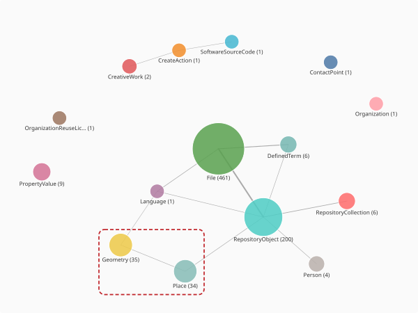

# Mapping the places in a collection

Many RO-Crates record *where* something happened, but the geography rarely sits
where you might expect. A place's coordinates are usually not on the place itself;
they hang off a separate geometry entity, written as a line of
[Well-Known Text](https://en.wikipedia.org/wiki/Well-known_text_representation_of_geometry)
(WKT) such as `POINT(151.21 -33.86)` or a `POLYGON(...)`. This tutorial walks from a
loaded crate to an interactive map, following those links, reading the coordinates
out of the WKT, and finishing with several collections side by side, coloured by
the crate each place came from.

We'll use the **Farms to Freeways** example dataset from the
[Language Data Commons of Australia (LDACA)](https://www.ldaca.edu.au/), an oral-history
collection about the suburbanisation of western Sydney. Its records are anchored to the
street addresses where interviews were recorded.

## What you'll learn

- Finding the `Place` entities in a crate and the geometry linked to each one.
- Reading coordinates out of WKT, for both points and polygons, with shapely.
- Annotating places with `longitude` / `latitude` columns and flattening to pandas.
- Drawing an interactive map with Plotly Express.
- Putting several crates on one map, coloured by their origin.
- Geocoding place names when a crate records no coordinates at all.

## Running this tutorial

While `crategraph` is pre-release, launch from the repository root with `uv run`, pulling
in the project plus the plotting and geocoding dependencies:

```bash
uv run --all-extras --with jupyter --with pandas --with plotly --with shapely --with geopy jupyter notebook
```

## 1. Load the crate and find the places

```python
from crategraph import Crate

crate = Crate("data/ldaca/metadata_only/Farms_to_Freeways_Example_Dataset")
crate
```

```
Graph(763 entities, 1765 relationships, source='data/ldaca/metadata_only/Farms_to_Freeways_Example_Dataset')
```

Before zooming in, `glimpse()` gives a one-look overview. It collapses every entity to its
primary type, so you can see what kinds of thing the crate holds and how they connect, a handy
orientation before committing to a query (in a notebook it renders inline):

```python
crate.glimpse()
```



Each node is an entity type, labelled with its count; the lines are relationships between
those types. Most of the crate is the interviews and their media, `File` (461) and
`RepositoryObject` (200), but the two types carrying the geography are boxed in red:
**Place** (34) and **Geometry** (35), joined by a single edge. That link is the whole story
of this tutorial: a place does not hold its own coordinates, it *points* to a separate
`Geometry` that does. We follow that edge below.

`select()` narrows the graph to a single type. The locations are `Place` entities:

```python
places = crate.select(entity_types=["Place"])
places
```

```
Graph(34 entities, 0 relationships, source='data/ldaca/metadata_only/Farms_to_Freeways_Example_Dataset')
```

Thirty-four places, and notice the **0 relationships**: narrowing to `Place` has dropped
every edge, because the entities those edges pointed to are not themselves places. That
matters in a moment, because the coordinates live on the other end of one of those edges.

## 2. Follow a place to its geometry

Pick one place and look at its raw properties:

```python
place = places.where(address="131 Macquarie st, sydney").entities[0]
place.properties
```

```
{'address': '131 Macquarie st, sydney',
 '@label': '131 Macquarie st, sydney',
 'geo': 'http://omeka.uws.edu.au/farmstofreeways/api/geolocations/24#GEO'}
```

There is a human-readable `address`, but no latitude or longitude. The `geo` property is
not a coordinate; it is a *reference* to a separate `Geometry` entity. Those geometry
entities are where the coordinates live, written as Well-Known Text. We can look at one
directly:

```python
crate.select(entity_types=["Geometry"]).entities[0].properties
```

```
{'asWKT': 'POINT(150.63825488091 -33.773081221375)'}
```

That `asWKT` value is a coordinate written as Well-Known Text, the form the
[RO-Crate guidance recommends](https://www.researchobject.org/ro-crate/quick-reference#contextual-entities)
for a `Place`'s geometry (a place *should* reference a `Geometry` entity whose `asWKT`
expresses the point or shape in WKT). `POINT(lon lat)` lists **longitude first**, then
latitude, which is western Sydney. Two wrinkles show up across crates: some store the WKT
directly on the `Place` (no `geo` hop), and some namespace the key as `geo:asWKT` rather
than `asWKT`. The helper in the next step handles all three cases, linking each place to its
own geometry.

## 3. From WKT to coordinates

We don't have to parse WKT by hand; [shapely](https://shapely.readthedocs.io/) reads it.
`wkt.loads` turns the string into a geometry object, and `.centroid` collapses any shape to a
single point: a `POINT` returns itself, while a `POLYGON` (a postcode or a state boundary)
returns its centre. That keeps every place, whatever the shape of its geometry, to one
mappable point:

```python
from shapely import wkt

shape = wkt.loads(
    "POLYGON((140.999271 -37.505041, 153.638673 -37.505041, "
    "153.638673 -28.157015, 140.999271 -28.157015, 140.999271 -37.505041))"
)
shape.centroid.x, shape.centroid.y
```

```
(147.318972, -32.831028)
```

A small helper finds a place's WKT (on the entity itself or on a linked geometry, under
either key) and hands it to shapely. Here `e` is an entity *view*, the object an
`annotate_entities` function receives, which is what lets it follow the `geo` link:

```python
def place_point(e):
    """A place's geometry as a shapely point (its own POINT or a POLYGON's centroid),
    whether the WKT sits on the place itself or on a linked Geometry."""
    raw = (e.get("asWKT") or e.get("geo:asWKT")
           or e.related("geo").first(key="asWKT")
           or e.related("geo").first(key="geo:asWKT"))
    if not raw:
        return None
    return wkt.loads(raw[0] if isinstance(raw, list) else raw).centroid
```

We put it to work in the next step.

## 4. Build a table of mapped places

`annotate_entities` adds a field to every entity, computed by a small function we supply
(the `lambda e: ...` is a one-line function in which `e` is one entity). Because the
coordinates are reached through the `geo` edge, we annotate the **whole crate** (where that
edge exists) and only then narrow to the places:

```python
import pandas as pd

located = crate.annotate_entities(
    longitude=lambda e: place_point(e).x if place_point(e) else None,
    latitude=lambda e: place_point(e).y if place_point(e) else None,
).select(entity_types=["Place"])

df = pd.DataFrame(located.entity_records(columns=["address", "longitude", "latitude"]))
df = df.dropna(subset=["latitude"])
print(len(df), "places with coordinates")
df.head()
```

```
34 places with coordinates
```

```
                    address  longitude   latitude
  74 River Road, Emu Plains 150.666511 -33.756987
                            150.708486 -33.754658
36 Lalor Road, Quakers Hill 150.889739 -33.727179
                            150.661456 -33.760737
  4 Colless Street, Penrith 150.708667 -33.756918
```

All thirty-four places resolved to a coordinate in the western-Sydney corridor: Emu Plains,
Quakers Hill, Penrith. The `dropna` keeps only the places that have
coordinates; everything else is plain pandas. Two things are worth noticing: the rows arrive
in no particular order (sort them if you want a tidy table, but the map won't care), and a
couple of places carry coordinates without a street address, both fine for plotting.

## 5. Draw the map

With `longitude` and `latitude` columns in hand, Plotly Express puts them on a slippy map.
`map_style="open-street-map"` uses OpenStreetMap tiles and needs no account or token:

```python
import plotly.express as px

fig = px.scatter_map(
    df, lat="latitude", lon="longitude", hover_name="address",
    center=dict(lat=df["latitude"].mean(), lon=df["longitude"].mean()),
    zoom=10, height=430, map_style="open-street-map",
)
fig.update_traces(marker=dict(size=11, color="#c1272d", opacity=0.8))
fig.update_layout(margin=dict(l=0, r=0, t=0, b=0))
fig.show()
```

The map below is interactive: scroll to zoom, drag to pan, and hover any marker to read its
address. The cluster sits across the western suburbs of Sydney, with a couple of outliers
in the city centre.

<iframe src="../../assets/farms-to-freeways-map.html" width="100%" height="430"
        style="border:none" loading="lazy" scrolling="no" title="Farms to Freeways recording locations"></iframe>

## 6. Several collections on one map, coloured by origin

The same pattern works on any crate, so we can compare collections. We wrap the
annotate-then-select from the last section into one function (given a crate path, it returns
the places that have coordinates as plain dicts) and run it over three LDACA corpora.
`entity_records` already hands back dicts, so combining is just adding an `origin` key and
appending; reducing every geometry to a centroid means one crate's postcode polygons and
another's address points become comparable markers:

```python
from collections import Counter

def place_records(path):
    """Load a crate and return its places that carry coordinates, as plain dicts."""
    located = Crate(path).annotate_entities(
        longitude=lambda e: place_point(e).x if place_point(e) else None,
        latitude=lambda e: place_point(e).y if place_point(e) else None,
    ).select(entity_types=["Place"])
    return [r for r in located.entity_records(columns=["address", "longitude", "latitude"])
            if r["latitude"] is not None]

sources = {
    "Farms to Freeways": "data/ldaca/metadata_only/Farms_to_Freeways_Example_Dataset",
    "Slang Survey":      "data/ldaca/metadata_only/Australian_Slang_Survey_Data",
    "COOEE":             "data/ldaca/metadata_only/A_COrpus_of_Oz_Early_English__COOEE_",
}

places = []
for origin, path in sources.items():
    for record in place_records(path):
        # COOEE also records England; keep markers within Australia
        if 110 < record["longitude"] < 155 and -45 < record["latitude"] < -9:
            places.append(record | {"origin": origin})

Counter(p["origin"] for p in places)
```

```
Counter({'Slang Survey': 1235, 'Farms to Freeways': 34, 'COOEE': 8})
```

The three crates carry geography at very different grains: the Slang Survey pins respondents
to 1,235 postcode areas, Farms to Freeways to 34 Sydney street addresses, and COOEE to a
handful of colony- and state-sized regions. Colouring by origin shows each collection's
footprint at a glance:

```python
allplaces = pd.DataFrame(places)   # one DataFrame, only because Plotly wants one

origin_colours = {
    "Farms to Freeways": "#c1272d",   # the same red as the single-crate map above
    "Slang Survey": "#1f77b4",
    "COOEE": "#6a3d9a",               # purple, since green blends into the base map
}

fig = px.scatter_map(
    allplaces, lat="latitude", lon="longitude", color="origin",
    color_discrete_map=origin_colours,
    # draw the populous Slang Survey first, so the rarer crates sit on top
    category_orders={"origin": ["Slang Survey", "Farms to Freeways", "COOEE"]},
    hover_name="address", zoom=3.2, height=480, map_style="open-street-map",
)
fig.update_traces(marker=dict(size=9, opacity=0.7))
fig.update_layout(margin=dict(l=0, r=0, t=0, b=0), legend_title_text="Origin crate")
fig.show()
```

<iframe src="../../assets/corpora-origin-map.html" width="100%" height="480"
        style="border:none" loading="lazy" scrolling="no" title="Three LDACA corpora coloured by origin crate"></iframe>

The Slang Survey blankets the populated south-east, Farms to Freeways concentrates on
western Sydney, and COOEE's centroids spread thinly across the colonies. Use the legend to
hide a crate and compare the others.

## 7. When a crate has only place names: geocoding

Not every crate ships coordinates. Many record a location as nothing but a name, and then
there is no WKT to read, so you have to *geocode*: ask a service to turn "Ballarat" or "Naples"
into a latitude and longitude. The University of Melbourne (UMPC) crate from the
[temporal tutorial](exploring-temporal-dimensions.md) is one of these; its places are the
birthplaces and deathplaces of the people it records.

```python
umpc = Crate("data/ohrm/UMPC-ro-crate")
umpc_places = umpc.select(entity_types=["Place"])
umpc_places.where(name="Balwyn").entities[0].properties
```

```
{'name': 'Balwyn'}
```

A name and nothing else: no `geo` link and no `asWKT`, so `place_point` would return `None`
here; there is simply nothing to parse. To map these places we geocode their names.

We'll use [geopy](https://geopy.readthedocs.io/), which wraps many geocoding services. Its
free OpenStreetMap geocoder, Nominatim, needs no account, only a descriptive `user_agent`
and, by its [usage policy](https://operations.osmfoundation.org/policies/nominatim/), no more
than one request per second. `RateLimiter` enforces that pace for us. Start with one place:

```python
from geopy.geocoders import Nominatim
from geopy.extra.rate_limiter import RateLimiter

geocoder = Nominatim(user_agent="crategraph-mapping-tutorial/1.0")
geocode = RateLimiter(geocoder.geocode, min_delay_seconds=1.5)

location = geocode("Balwyn, Victoria, Australia")
location.address, location.latitude, location.longitude
```

```
('Balwyn, Victoria, 3103, Australia', -37.8091737, 145.0833678)
```

### Geocoding the whole collection

Now scale up to every birthplace. Two habits matter. First, **cache**: look each name up
once and reuse the answer, so a re-run doesn't hammer the service. Second, **be patient**:
at roughly one request per second, ~180 places take a few minutes. The `to_coords` helper
caches into a dict, so the two lookups for `latitude` and `longitude` cost only one request:

```python
cache = {}

def to_coords(e):
    if e.name not in cache:
        cache[e.name] = geocode(e.name)
    return cache[e.name]

located = umpc_places.annotate_entities(
    latitude=lambda e: to_coords(e).latitude if to_coords(e) else None,
    longitude=lambda e: to_coords(e).longitude if to_coords(e) else None,
)
gdf = pd.DataFrame(located.entity_records(columns=["name", "latitude", "longitude"]))
gdf = gdf.dropna(subset=["latitude"])
print(f"geocoded {len(gdf)} of {len(umpc_places.entities)} places")
```

```
geocoded 162 of 178 places
```

Sixteen names did not resolve, and a few that did landed in the wrong place; geocoding a
bare name is inherently ambiguous. `"113 Prospect Rd, Newton"` came back in Mississippi,
because "Newton" matches towns the world over. In practice you would add context to the
query (`f"{name}, Australia"`), inspect the returned `location.address` before trusting it,
or switch to a paid or self-hosted geocoder for bulk work. For a first map, the resolved
majority is enough:

```python
fig = px.scatter_map(
    gdf, lat="latitude", lon="longitude", hover_name="name",
    zoom=1, height=480, map_style="open-street-map",
)
fig.update_traces(marker=dict(size=9, color="#2a6f97", opacity=0.75))
fig.update_layout(margin=dict(l=0, r=0, t=0, b=0))
fig.show()
```

The birthplaces cluster in Victoria and around Melbourne, with a strong tail back to Britain
and Europe, the shape you would expect of a nineteenth- and twentieth-century Australian
university. Hover any marker for the place name.

<iframe src="../../assets/umpc-birthplaces-map.html" width="100%" height="480"
        style="border:none" loading="lazy" scrolling="no" title="Geocoded UMPC birthplaces and deathplaces"></iframe>

## Next steps

Because `annotate_entities` writes plain columns, the mapped coordinates feed straight into
the [From Graph to DataFrame](from-graph-to-dataframe.md) workflow: group places by region,
write a CSV, or join the geography onto the rest of your analysis. Pair the map with
[Exploring Temporal Dimensions](exploring-temporal-dimensions.md) to ask not just *where* a
collection's records sit, but *when*.
