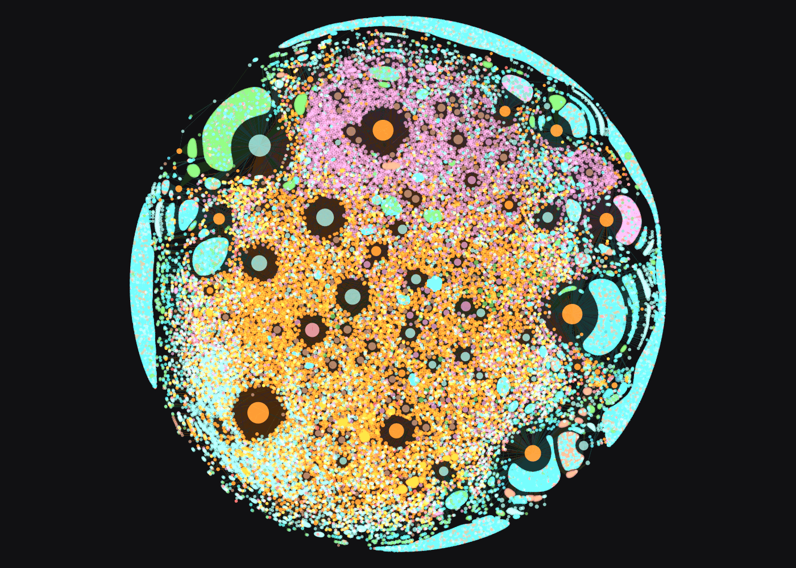
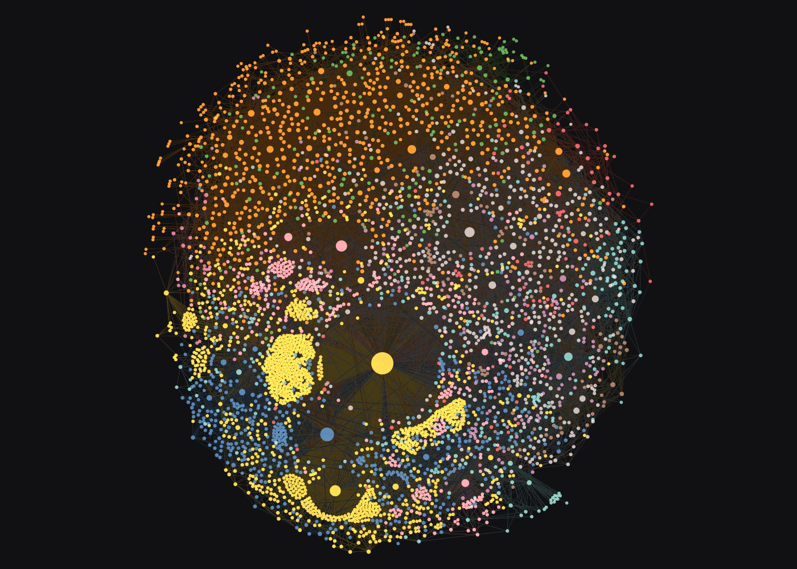

# Visualising a collection

A large RO-Crate is hard to picture from tables alone. crategraph can draw it: a one-look
overview of the types, the whole network rendered in the browser, focused subgraphs you can
pan and click, and a 3D view of a small neighbourhood. This tutorial works through all of
these on a big, richly connected crate.

We'll use the **Encyclopedia of Australian Science and Innovation (EOAS)** crate, a
biographical database of Australian scientists with their publications, institutions, and the
places they worked. It holds tens of thousands of entities, so it makes the renderers earn
their keep.

## What you'll learn

- A type-level overview of any crate with `glimpse()`.
- Rendering a whole graph with the interactive sigma (2D WebGL) renderer.
- Styling nodes by type and sizing them by how connected they are.
- Narrowing to an ego network with `select()` and `expand()`, then visualising it live.
- Colouring nodes by detected communities with `detect_communities()`.
- An interactive 3D view of a small neighbourhood.

## Running this tutorial

Install crategraph with Jupyter, then launch a notebook:

```bash
python -m pip install crategraph jupyter
jupyter notebook
```

crategraph includes the fast ForceAtlas2 layout engine used for larger graphs. The 3D view
loads its JavaScript from a CDN, so viewing it needs a network connection.

## 1. Load the crate and glimpse its shape

```python
from crategraph import Crate

crate = Crate("data/ohrm/EOASI2022-ro-crate")
crate
```

```
Graph(43255 entities, 95052 relationships, source='data/ohrm/EOASI2022-ro-crate')
```

Forty-three thousand entities is far too many to read as a table. `glimpse()` collapses the
crate to one node per type, so you can see what it holds and how the types connect before
drawing anything in detail:

```python
crate.glimpse()
```


The crate is a publications-people-places network: `PublishedResource` (21,605) and `Person`
(9,677) dominate, linked through `Place` (3,181) and `Corporate_Body` (2,898) entities. Most
edges are `preparedBy`, recording who authored or curated each resource.

## 2. The whole graph

`visualise()` renders the entire graph. The default renderer is `"2d"`, an interactive
sigma.js WebGL canvas. We colour nodes by type and size them by how many connections each
has, so the hubs stand out:

```python
crate.visualise(colour_by="type", size_by="connections", filepath="eoas.html")
```



Each colour is an entity type, and the largest nodes are the busiest hubs: prolific curators,
and places like Melbourne that anchor many records. Running this yourself opens an interactive
page where you scroll to zoom, drag to pan, and click a node for its details. We show a
snapshot here because the full 43,000-node page is several megabytes.

## 3. Zoom into a subset

The whole graph is striking but dense. Usually you want a neighbourhood. `select()` picks a
starting entity and `expand()` grows outward by a given number of hops, building an ego
network. Here we take the Australian Academy of Science and its immediate connections:

```python
academy = crate.select(id="#A000200").expand(depth=1)
academy
```

```
Graph(551 entities, 1552 relationships, source='data/ohrm/EOASI2022-ro-crate')
```

Five hundred nodes is small enough to ship as a live, interactive page:

```python
academy.visualise(colour_by="type", filepath="academy.html")
```

<iframe src="../../assets/eoas-academy.html" width="100%" height="560"
        style="border:none" loading="lazy" scrolling="no" title="Australian Academy of Science ego network"></iframe>

This one is interactive in the page: zoom, pan, click any node to read its properties, and use
the search box to find an entity. The Academy sits at the centre with its members and award
winners around it.

## 4. Colour by community

Colouring by type shows what each node *is*. Colouring by community shows how the graph
*clusters*. `detect_communities()` runs the Louvain algorithm and tags every entity with a
`community` property, which `visualise()` can then colour by. We take CSIRO's wider
neighbourhood, two hops out:

```python
csiro = crate.select(id="#A000196").expand(depth=2)
csiro
```

```
Graph(4463 entities, 20793 relationships, source='data/ohrm/EOASI2022-ro-crate')
```

`simple=True` drops the side panels for a clean canvas, which suits a dense graph coloured by
community. As with the whole graph, we show a snapshot of the result:

```python
csiro.detect_communities().visualise(
    colour_by="community", size_by="connections", simple=True, filepath="communities.html"
)
```



The algorithm finds nine communities, each in its own colour: clusters of people, resources,
and the institutions that bind them, which separate far more clearly than the single-colour
hairball a flat view would give at this size.

## 5. A 3D view of a small neighbourhood

The 3D renderer suits small graphs you can turn over in space. Rather than a person, we take a
place: Clayton, a Melbourne suburb that hosts Monash University and several CSIRO divisions,
with everything the crate anchors there:

```python
clayton = crate.select(id="#Clayton").expand(depth=1)
clayton
```

```
Graph(45 entities, 70 relationships, source='data/ohrm/EOASI2022-ro-crate')
```

```python
clayton.visualise(renderer="3d", colour_by="type", filepath="clayton-3d.html")
```

<iframe src="../../assets/eoas-place-3d.html" width="100%" height="520"
        style="border:none" loading="lazy" scrolling="no" title="Research bodies around Clayton in 3D"></iframe>

The place sits at the centre with the research bodies based there around it (`Corporate_Body`),
along with a few publications (`PublishedResource`). Drag to rotate and scroll to zoom. At this
scale the structure stays legible from any angle, whereas tens of thousands of nodes in 3D
become an unreadable cloud, which is why 3D is best kept for small neighbourhoods.

## Next steps

`visualise()` has more renderers and controls. `renderer="svg"` writes a static,
dependency-free image, handy for a report or alongside the
[From Graph to DataFrame](from-graph-to-dataframe.md) workflow, and `renderer="pyvis"` uses
vis.js. Pass `edge_width="<property>"` to weight edges by a value. Pair this with
[Mapping the places in a collection](mapping-collection-places.md) to put the same kind of
crate's geography on a map.
